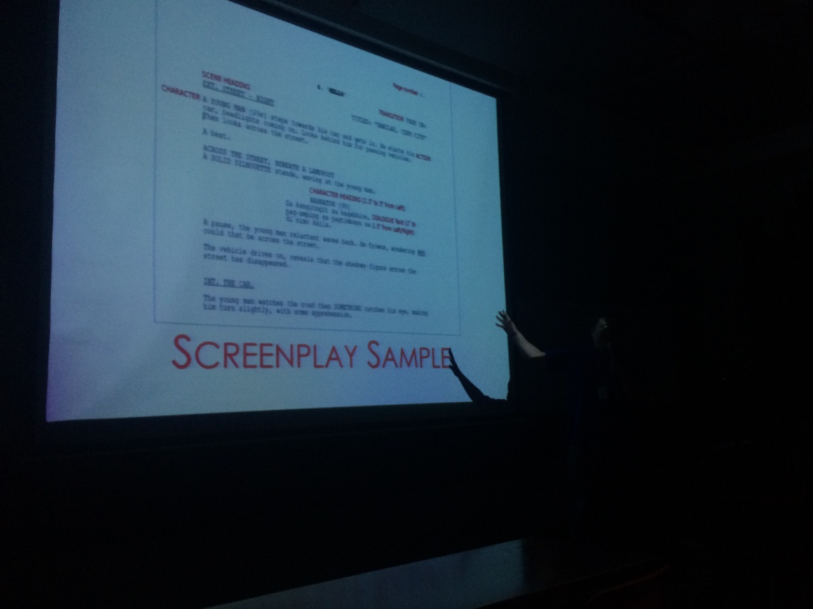
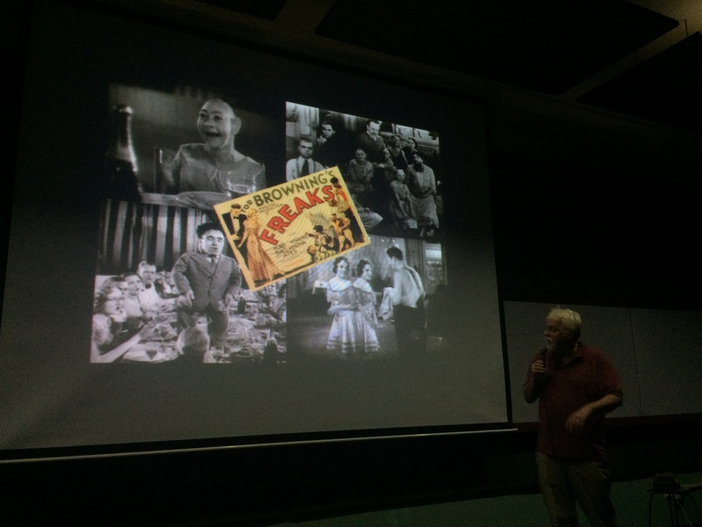

+++
date = 2023-09-26
title = "Revisiting: Sinekultura"
slug = "revisiting-sinekultura"
categories = ["film", "personal"]
keywords = ["cinema", "sinekultura", "Cebuano"]
summary = "I stumbled upon my old Tumblr page for a class at university."
image = "/revisiting-sinekultura/revisiting-sinekultura.jpg"
+++

I feel like I didn't appreciate the Sinekultura class enough. It was a class where we watched films, both old and new, and that's all we did. We would just watch the films, and sometimes our professor would ask us to write essays about them. We even had workshops and talks and we invited professors and film scholars anywhere in the Philippines.

Sinekultura: *Sine* means "cinema" and *kultura* means "culture" in Cebuano, which are two of my favorites, to be honest. I mean, I attended the class, but I wish I had taken it more seriously. [^1]

 (1994)")

We had this class until sophomore year, and if I remember correctly, we had to write a final essay each semester about the films that had an impact on us.

I came across my old Tumblr page that I used as a way to keep track of the Sinekultura class. We would take pictures of the films we watched in the theater. Those memories flooded back and it hit me how much I truly treasure the experiences and knowledge I gained from that class. I admit, I wish I had valued it more back then.

")

")

Looking back, I realize that the Sinekultura class gave us a special and valuable opportunity to really understand cinema and culture. It allowed us to explore different film genres, learn from experts in the field, and develop our own critical thinking skills through the essays we wrote. It was kinda like learning how to curate and be a curator for film organizations or film festivals. I remember how each week, we would have a theme or genre, and it was so much fun. I was always curious about what the next film would be and how it would make me feel and reflect on the previous one. The class was about understanding why these films were important in their time and how they still resonate with us today. It was about recognizing how cinema can challenge social norms, including how women are portrayed.

Sinekultura wasn't just about watching movies and attending workshops, it was about really connecting with the stories and ideas behind them.

[^1]: Sinekultura is also a film journal focused on the cinema of the Philippines.