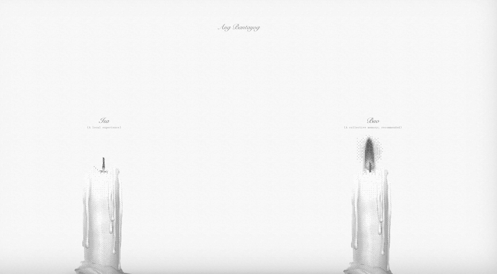

On September 23, 1972, the Philippines experienced a significant event when the dictator Ferdinand Marcos declared martial law. This decision granted Marcos immense authority and control over the nation, allowing him to exercise his power without limitations. The imposition of martial law marked a turning point in Philippine history, as it led to a period of repression, human rights violations, and political suppression. The digital landscape has played a role in the rise of Bongbong Marcos Jr., the son of the dictator, who now holds the position of the 17th president of the Philippines. The impact of this action reverberated throughout the country and left a lasting imprint on the collective memory of the Filipino people.

[*Ang Bantayog*](http://ang-bantayog.com/) (The Monument) is an internet art piece by Chia Amisola that showcases 11,103 candles symbolizing the names from the Human Rights Victims' Claims Board's Roll of Victims. The website reflects the struggle of collective memory since the imposition of martial law in the Philippines. It can be experienced in two ways: 'one' and 'whole,' altering how memories are shared.

> Intentionally programmed & designed to keep ‘defaults’ in mind, the monument operates within the environmental constraints of its technologies. For instance, ‘localStorage’ is used to store the ‘names remembered’, a form of data storage without expiration that is usually only erased when the user’s (browser) history itself is cleared. The website itself is accessible by a temporary domain (e.g. an equivalent to acquiring ‘property’ on the web, in exchange for a human-readable address in the URL).

> The monument is an imperfect site. By nature, it can never be a true ‘memorial’. Rather than a more lasting monument to memory, it will exist as another memory itself. It is perhaps more symbolic of the struggle of memory. It is transient, temporary, and tethered to the technologies it’s built upon—which falter more than man. What does it mean, to mourn and become in digital space? In between waking, remembering, and action, can we ‘never forget’ online? Perhaps the only way to combat the rate of decay is to collectively gather, and remember—as when the infrastructure that holds our memories fail, human hands might rebuild then.

More about this on [Chia's blog](https://chias.blog/2023/the-monument/). And a Q&A from Rappler. There's also a [Rappler article](https://www.rappler.com/nation/ang-bantayog-website-hopes-rethink-remember-martial-law/) about *Ang Bantayog*.

It’s my first time to encounter such internet art and Chia Amisola has done an exceptional job of demonstrating respect for the victims of Martial Law. And in a way, the artwork serves as a powerful tribute to those affected by the oppressive regime.

The idea of utilizing websites and the internet to create a networked experience for memorializing victims of Martial Law is truly remarkable. It demonstrates how the inherent functionalities of browsers and the internet can be harnessed to pay tribute to those affected by the oppressive regime. It reminds me of the enduring power of collective remembrance and the potential of technology to preserve and convey historical narratives. The concept of leveraging the inherent nature of browsers and the internet to facilitate this memorialization is both ingenious and impactful.

We must never forget so that we may never again suffer the same fate.

Those who visit the website can light a candle once a day to reveal the name of a Martial Law victim.

***Never forget, never again.***