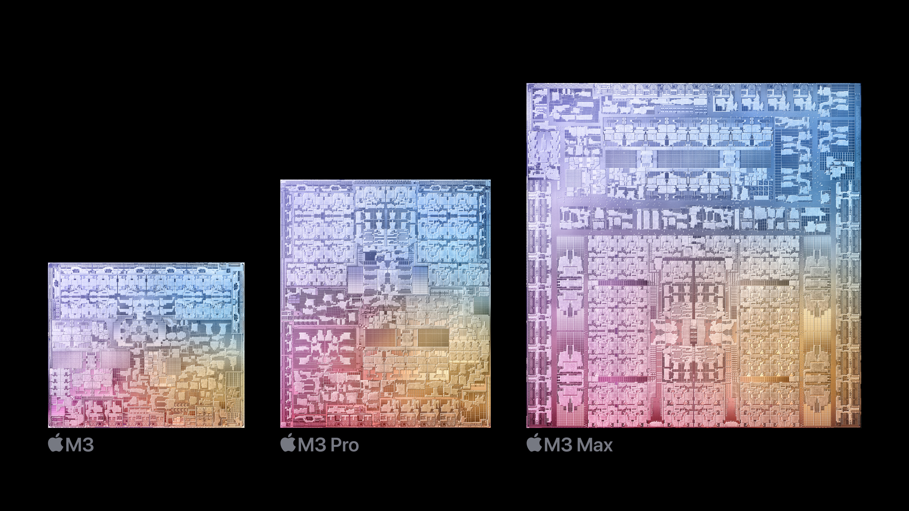
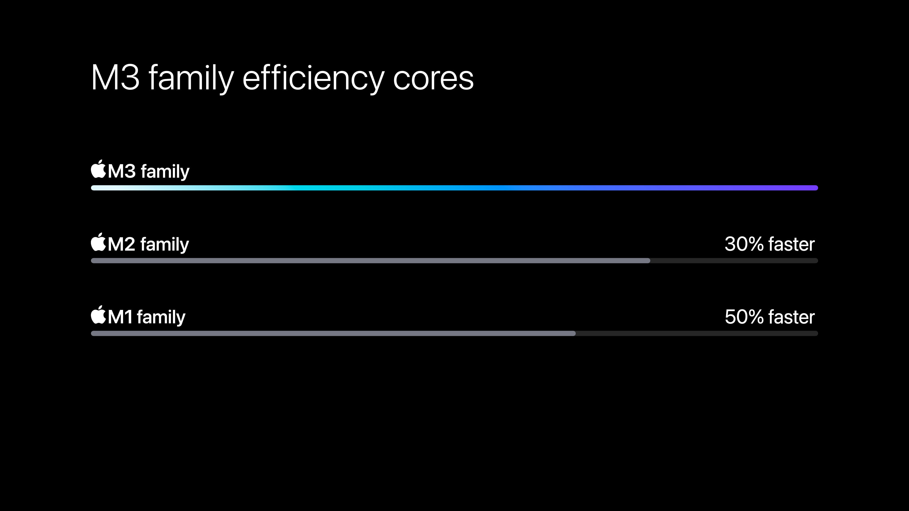
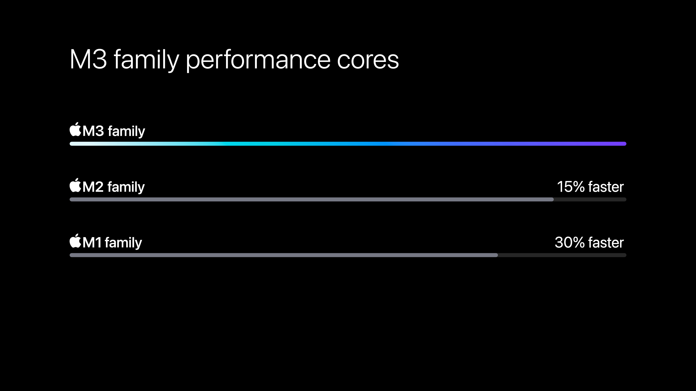

+++
date = 2023-10-31
title = "New M3 family of chips"
slug = "new-apple-m3-chips"
categories = ["apple", "MacBook", "technology"]
keywords = ["Apple", "A17", "M3", "MacBook", "technology"]
summary = "M3, M3 Pro, and M3 Max chips, refreshed iMac and Space Black MacBook"
image = "/new-apple-m3-chips/new-apple-m3-chips.jpg"
+++

[Apple](https://www.apple.com/newsroom/2023/10/apple-unveils-new-macbook-pro-featuring-m3-chips/) has launched its new M3, M3 Pro, and M3 Max chips, accompanied by updated iMac and MacBook Pro models. These chips provide enhanced performance and optimizations, thanks to a 3nm fabrication process. The refreshed iMac now incorporates the M3 chip, which is purported to be twice as fast as its predecessor, with no major design changes. The M3 Max can be configured with up to 128GB of RAM. The laptops boast improved GPU performance and hardware-accelerated ray tracing, making them suitable for Mac gaming. Battery life Apple had tested seems a bit odd, the MacBook Pro 14" with the M3 chip lasts up to 22 hours, the same model with the M3 Pro or M3 Max chip only lasts up to 18 hours.

Apple has consistently compared its new M3 chip to the M1 chip. The base M3 chip includes an eight-core CPU, comprised of four performance cores and four efficiency cores. Apple asserts that this offers up to 35% faster CPU performance than the M1.

Although we lack specific details on how the M3 compares to the M2, Apple did state last year that the M2 provides 18% faster CPU performance than the M1. The M3 also features a 10-core GPU with a next-generation architecture, purported to deliver 65% faster graphics performance than the M1.

The MacBook Pro now comes in a new Space Black color and offers higher peak brightness and a "fingerprint-resistant coating". [Jason Snell of Six Colors](https://sixcolors.com/post/2023/10/a-magic-number-new-macbook-pros-and-imacs-usher-in-the-m3-era/) said that Space Black is actually just a darker Space Gray.

> I got my greasy monkey paws on a Space Black laptop and can report that Apple’s as good as its word in the sense that it seems generally more resistant to fingerprints and other smudges.
> But I don’t want to exaggerate this feature: you can still see fingerprints. They just aren’t as prominent. This is a progressive improvement over something like the Midnight M2 MacBook Air, but it’s not a cure-all.

These features will be put to the test when reviewers get a chance to evaluate these new devices.

My M1 Max continues to perform superbly, handling my everyday tasks as an editor without a hitch. I suspect that the “complexity” of 4K, even 8K videos and processing them in software like Adobe might be causing it to freeze up once in a while, even when I'm working with Proxies.

The pricing for the 14-inch MacBook Pro with the M3 Pro chip starts at ₱129,990.00 ($1,999), the 16-inch MacBook Pro with M3 Max is at a whopping ₱219,990.00 ($3,499). For my ideal setup, I’m considering the 14-inch, M3 Max chip with 16‑core CPU, 40‑core GPU, 16‑core Neural Engine, 64GB unified memory and 1TB SSD storage would set me back at ₱261,990.00 ($4,199). This is undeniably a splurge, but it's perfectly suited for my needs. Yes, it's a significant investment, but it's one that promises to deliver in performance.

And in true Apple Online Store Philippines fashion, the product is currently unavailable for delivery.[^1]

For now, I plan to wait until I find a good reason to upgrade to an M3. I really wish software companies would be kinder to their products and optimize them, so we wouldn't feel the need to keep upgrading our hardware all the time.

[^1]: The [Apple Online Store Philippines](http://store.apple.com/ph) is a Singapore based store that sells and ships to customers in Philippines. The Apple Store sells and ships products to end user customers only [↗︎](https://www.apple.com/ph/shop/help/shipping_delivery)