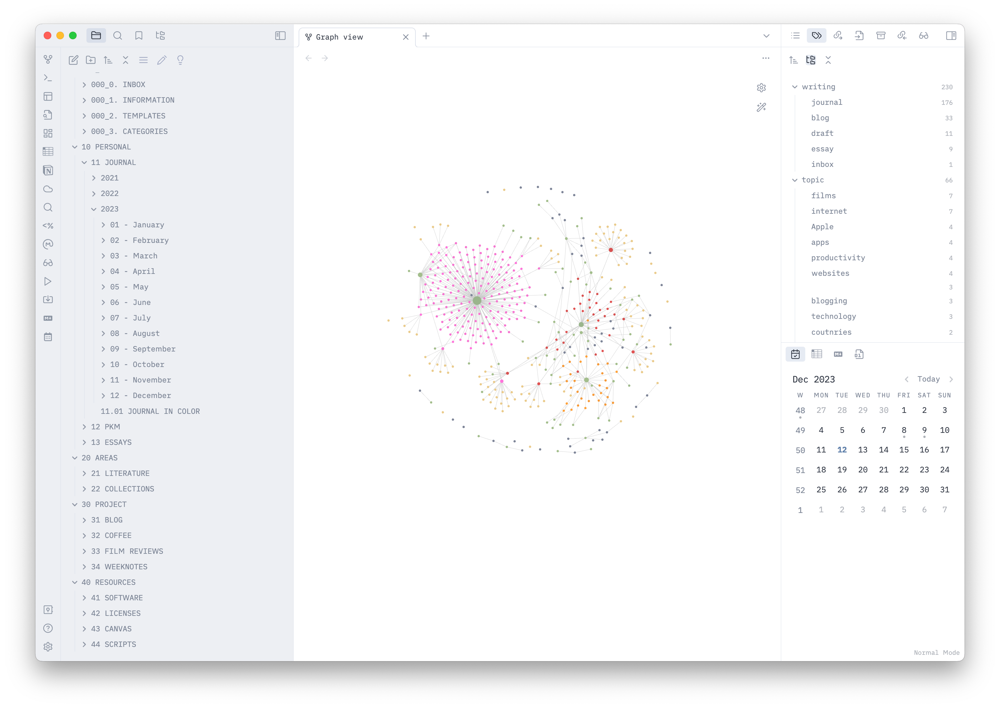

+++
date = 2023-12-11
title = "Annual Cleanup"
slug = "annual-cleanup"
categories = ["personal", "Digital Relationships"]
keywords = ["decluttering", "new year", "2024", "digital organization"]
summary = "Clutter into order using a systematic approach"
image = "/annual-cleanup/annual-cleanup.jpg"
+++

I consistently make an effort to declutter my clothes and digital files every year. This time, I've made more progress than ever before. Previously, I would often stop halfway through the process, but this year, I'm committed to seeing it through.

I have a large amount of digital files stored across my hard drives and cloud services. Initially, I thought I had them organized by putting them into a "General" folder, irrespective of the type of file. But I have now sorted them according to specific areas and categories, similar to the [Johnny Decimal](https://johnnydecimal.com/?ref=krabf.com) system.

I'm eager to wrap up this digital cleanup to make room for the "holiday spirit."[^1] We just decluttered our closet last Sunday and we now have two bags of clothes ready for donation. Funny thing is, we thought the closet would take all day, but it was actually our desk cabinet that really ate up our time. We had to figure out how to fit all our keyboard and stationery stuff into our drawer.

")

While we embrace minimalism, I personally own a significant amount of tech equipment and coffee-related items that I've collected over the years and cannot simply discard. These items hold great value for me, as they were either gifts or purchases I personally made. I maintain my old tech equipment well, regularly checking their functionality and cleaning them monthly. But I’m happy I’m able to free up some space in the cabinet, like my camera monitor and cage that have spent most of the year in my camera bag, back to my hometown. As for my coffee stuff, it’s coffee and I drink it everyday. I have already cleaned up my boxes last September.[^2] My coffee bar remains the same and have plans to add more items to my setup. Sorry, not sorry.

I'm close to finishing the revamp of my digital files. My Google Drive files are now well-organized. I've also completed re-structuring my Obsidian vault, but I still lack a proper structure for my PKM system. The upcoming task involves sorting through my Raindrop bookmarks, which are estimated to contain ~3,000 links. This volume is due to my previous habit of indiscriminately saving everything there, including importing bookmarks from Chrome and Firefox. The final task for this year’s digital overhaul is to organize my Notion database, which will be quite a challenge considering it has ~10,000 pages. I'm continuing to use the JD System in conjunction with my personalized version of the [PARA Method](https://fortelabs.com/blog/para/?ref=krabf.com). Next year, I intend to address the content on my five hard drives, yes, FIVE.[^3]

I swear by the [Johnny Decimal system](https://johnnydecimal.com/?ref=krabf.com). It took me a considerable amount of time to figure out how to implement this system effectively. I first learned about it early this year, and now, at the end of the year, I've finally managed to create an organizational system that works for me.

Here's to a tidier and more organized living space in 2024!

[^1]: I'm already starting to feel a bit worn out from all the socializing I’ll be doing.
[^2]: My partner asked me why I love my coffee boxes so much. It's not merely about the box's aesthetics or its thoughtful design like the robust packaging of my [carafes](<https://en.wikipedia.org/wiki/Carafe#:~:text=A%20carafe%20(%2Fk%C9%99%CB%88,as%20carafes%20in%20American%20English.>) to prevent damage during transit — but about what's inside that brings me joy. Brewing coffee at home has been a lifesaver during the pandemic and has added excitement to my daily routine.
[^3]: I am tired already just thinking about the photos I have.