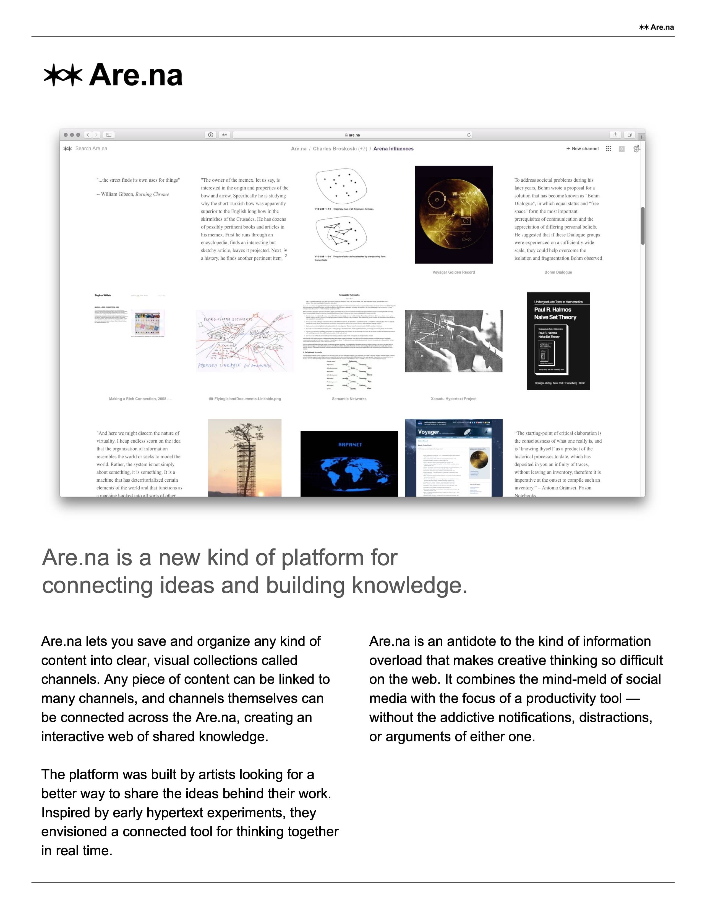
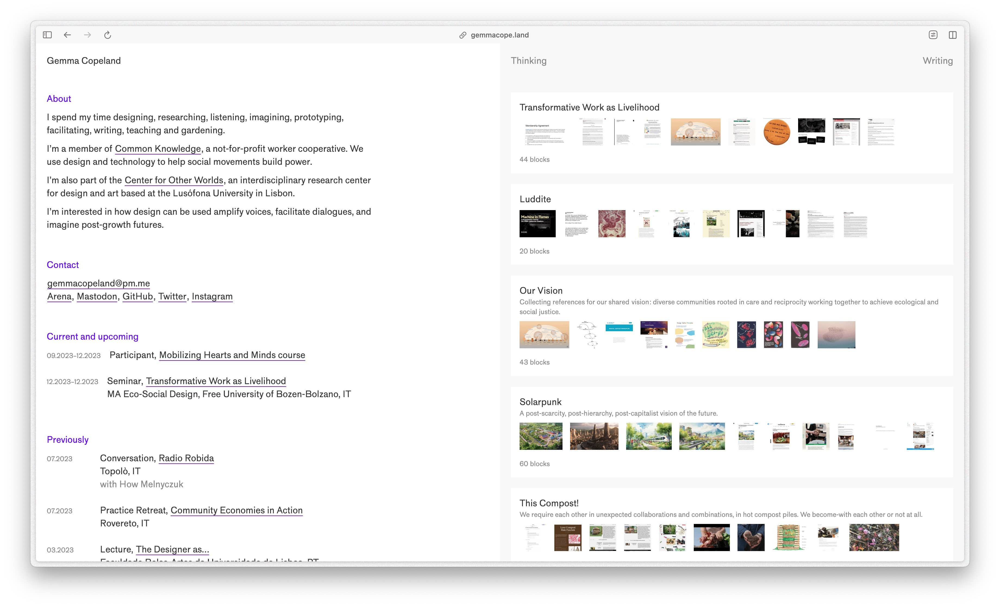
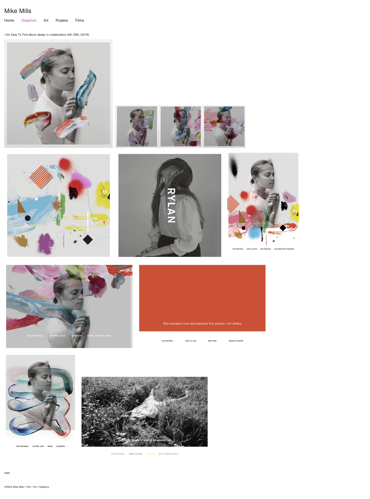

+++
date = 2023-12-22
title = "Collections"
slug = "collections"
categories = ["collections", "blogging"]
keywords = ["collections", "Arena", "Pinterest", "Cosmos", "MyMind", "Mike Mills", "Christopher Butler", "Gemma Copeland"]
summary = "Exploring curated online spaces"
image = "/collections/collections.jpg"
+++

  
The digital world is immense and filled with countless online spaces, but there are just a handful of these spots where I genuinely relish the feeling of getting lost and going down a rabbit hole. There's an indescribable beauty in immersing myself into the depths of other people's creations. It's not just about viewing or reading their work; it's about allowing myself to be absorbed into their world, to get a glimpse of their thoughts and ideas, and in a way to understand their emotions.

[Christopher Butler](https://www.chrbutler.com/) explores the subject of [personal picture collection](https://www.chrbutler.com/2023-12-08) in his recent post. His commitment to preserving a personal image archive highlights the distinct pleasure of owning and exploring a physical collection of visual inspiration. This got me thinking about the artist and filmmaker Mike Mills (please, I highly recommend watching 20th Century Women), who has beautifully curated a digital archive and collection of his works that’s available to the public. Mike Mills' site, [https://mikemillsmikemills.com/](https://mikemillsmikemills.com/), displays his life works for the past 30 years. It features a tidy grid layout with minimal decoration, reflecting the timeless appeal of a well-constructed site. This simplicity is not without purpose — it serves to draw the viewer's attention to the works themselves, allowing them to shine without distraction.

I am considering creating a page on my website to showcase my collections. I've got a bunch of interests I'd love to share, but I'm a bit worried that might make it too broad. There are sites now that allow you to share your collections publicly. I used to be a fan of Pinterest but it's become a bit overwhelming with all the ads and videos being added now. Despite that, I still find myself spending quite a bit of time on it for meal recipes. I am two weeks into using [Cosmos](https://www.cosmos.so/), a relatively new platform with a growing user base. They present themselves as a viable alternative to Pinterest, aiming to provide a similar platform for content collection and sharing. But its aesthetics remind me of the indie era of Tumblr circa 2012, with most of its images sourced from Instagram.

Pinterest, MyMind, and Cosmos share similarities as social networks for capturing inspiration with visually appealing interfaces and organizational features such as clusters or boards. [Are.na](http://are.na/) surpasses them in its unique approach. It's a treasure trove of a *carefully* cultivated garden of ideas gathered from people's internet discoveries, which can be truly inspiring. [Gemma Copeland](https://gemmacope.land/) has her Arena collection embedded into her website, and the way she curates her collections (channels), creates an engaging experience when navigating through them. I could spend all day scrolling through her channels.

  

    <figure class="sbs">

<figcaption>Are.na is a new kind of platform for connecting ideas and building knowledge, Image: Are.na</figcaption>
</figure>
  <figure class="sbs">

<figcaption>Are.na is a space where curiosity and collaboration are more important than likes, Image: Are.na</figcaption>

I have been using Are.na for some time now and it purposely steers clear of algorithms, and I have to say, it's such a breath of fresh air. It feels more like a real conversation and less like a machine trying to guess what I want to see. In my book, that's a big win.

The best [description](https://www.are.na/block/21512082) I've read on how someone might describe Arena at a party is this:

Interestingly, Are.na can also be seen as a [Memory Palace](https://www.are.na/blog/on-memory-palaces-and-visualizing-computation), as [Taulant Sulko](https://www.are.na/taulant-sulko) puts it; with channels organized into rooms for efficient information storage. This multidimensional portrayal adds depth to the collector’s persona, making the interaction more engaging and personal, which I find very appealing. Creating a personal "second internet" through tools like Are.na and adopting the Memory Palace concept is a fascinating approach to information organization. It reflects a thoughtful effort to overcome the limitations of standard search methods and promotes a more intentional and structured way of knowledge management.

> Another interesting way of collections is Commonplace Book which focuses on text-based collections, emphasizing individual reflection, while platforms like Are.na, Cosmos, MyMind, and Pinterest offer visually engaging, collaborative experiences. As someone who learns best through visuals, these platforms, with their diverse range of content such as films, graphics, and images, resonate with me more than traditional text-based mediums. I won't delve into the concept of commonplace books, as visual content naturally aligns with my preference for visual learning.

I'm still in the process of deciding which collections I want to share with everyone. I'm working on narrowing it down to the ones that really reflect me and what I love. Just as soon as I've got that sorted and figured out the best way to showcase them.

This exploration is more than just a simple pastime for me. It's a source of inspiration that sparks my imagination, ignites my creative spirit, and nudges me to step out of my comfort zone. It encourages me to explore new perspectives and to challenge my own creativity, pushing me to create something that will hopefully inspire others in the same way. And this keeps me from mindlessly scrolling through the chaotic world of social media.

I genuinely appreciate artists who, despite their success, still take the time to curate and showcase their work meticulously. It's not every day you come across filmmakers like Mike Mills who create a detailed catalog of their works. Some artists might have the attitude that people can just use Google to find out about them and their work. Personally, I believe that having your own portfolio and website says a lot about you as an artist and/or a professional. It shows your dedication, attention to detail, and respect for your craft.

