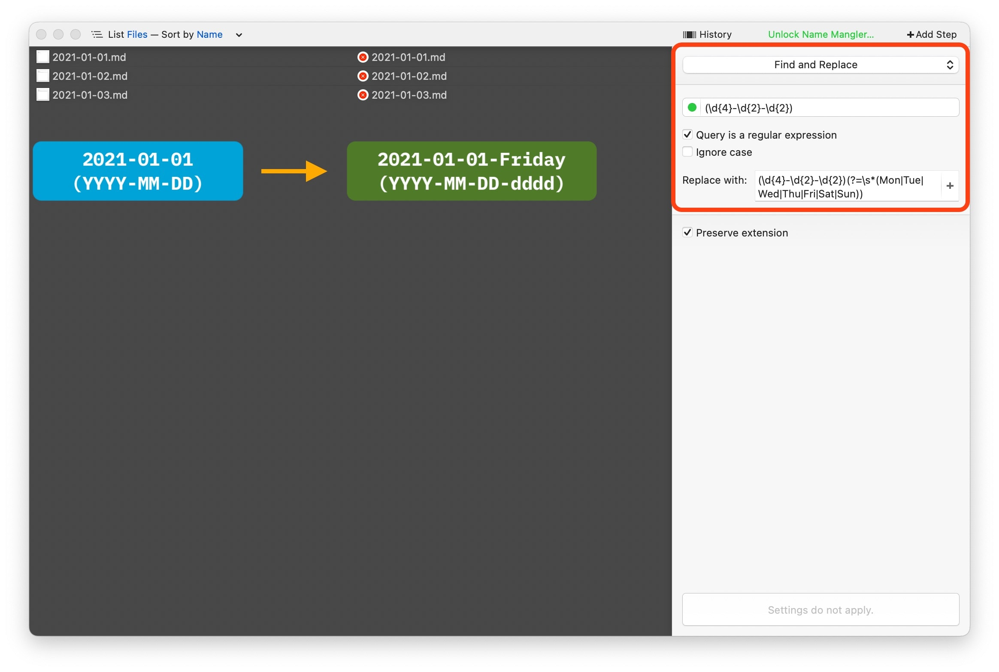

+++
date = 2023-12-28
title = "Automating Automator"
slug = "automating-automator"
categories = ["automation", "tools", "AppleScript"]
keywords = ["Apple", "automation", "AppleScript", "ChatGPT", "OpenAI"]
summary = "Gee pee tee things"
image = "/automating-automator/automating-automator.jpg"
+++


Attempting to rename multiple files with a specific filename was more challenging than I expected, especially when it required the use of RegEx. The applications I tried didn't solve the problem. I asked ChatGPT which software I could use for my task. It suggested Automator. This tool is built into Apple's macOS, offers various solutions, and best of all, it's free.

I was in the process of transferring numerous pages from my Notion Journal to Obsidian. To maintain consistency, I need the filenames to include the weekday, as this is my established naming convention in Obsidian. I didn't want to rename each of my three years' worth of journal entries individually. While exploring the [Automators](https://talk.automators.fm/) forum, I noticed someone else had a similar issue and another user recommended using RegEx. I've had previous experiences with RegEx that were frustrating, so I was hesitant to use it again. They also recommended some applications that supposedly made RegEx "easy". However, even after trying three different applications over two days, I was left frustrated. All I wanted was to finish the renaming and organizing task.



In the midst of my increasing frustration, I remembered ChatGPT and decided to ask for its "help". I asked about the script I should run to rename my files in the manner I desired. To my surprise, ChatGPT suggested using Apple's Automator, a free tool built directly into MacOS that I hadn't considered using before, as the forums suggested other apps, and the idea of creating a script in Automator seemed daunting.

I still don't understand RegEx but implementing the solutions suggested by ChatGPT using Apple's Automator proved to be simple and effective. The file renaming task was completed in under 5 hours without any additional apps. ChatGPT provided the complex RegEx script necessary to append the weekday to the journal filename.


``` #!/bin/bash

for file in "$@"; do
    # Extract date components using regex
    if [[ $file =~ ([0-9]{4}-[0-9]{2}-[0-9]{2}) ]]; then
        date_part="${BASH_REMATCH[1]}"
        
        # Get the day of the week
        day_of_week=$(date -jf "%Y-%m-%d" "$date_part" +"%A")
        
        # Append day of the week to the filename
        new_filename="${date_part}-${day_of_week}.md"  # Add .md as the file extension
        
        # Rename the file
        mv "$file" "$(dirname "$file")/$new_filename"
    fi
done

```

I've used Automator in the past for simple tasks like transferring specific files to different folders. When I needed to run scripts, I could usually find them with a quick Google search. I've also used ChatGPT for coding and grammar assistance, but I never considered that it could provide Apple Scripts.