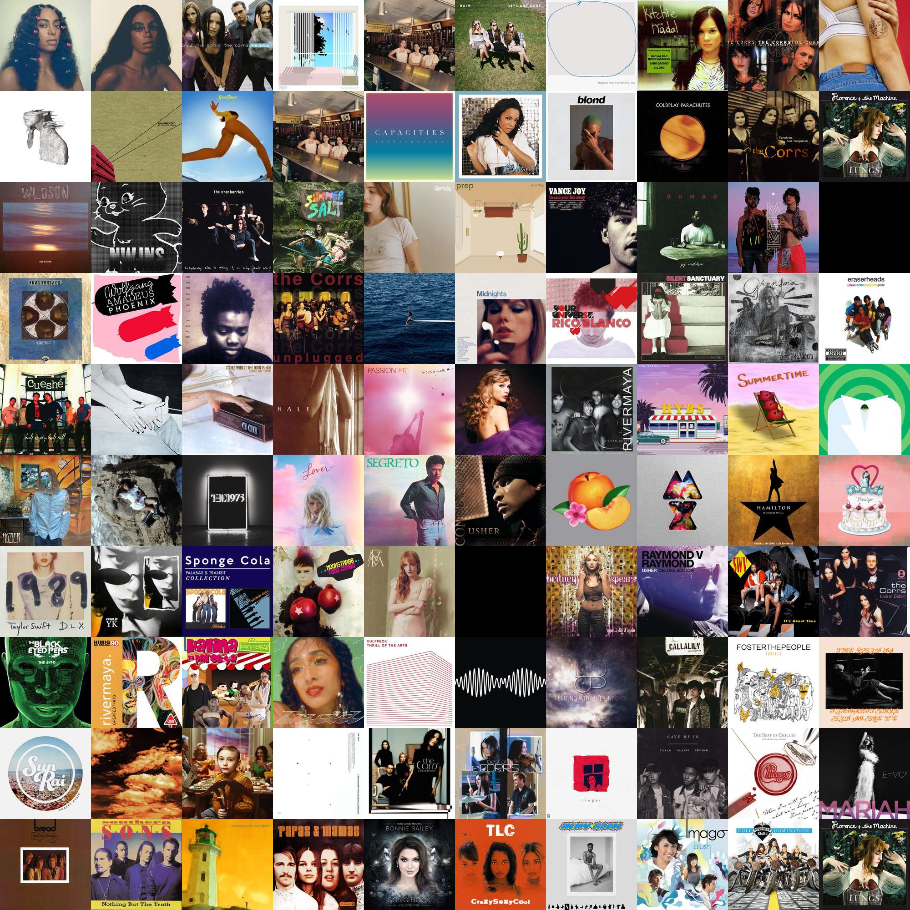
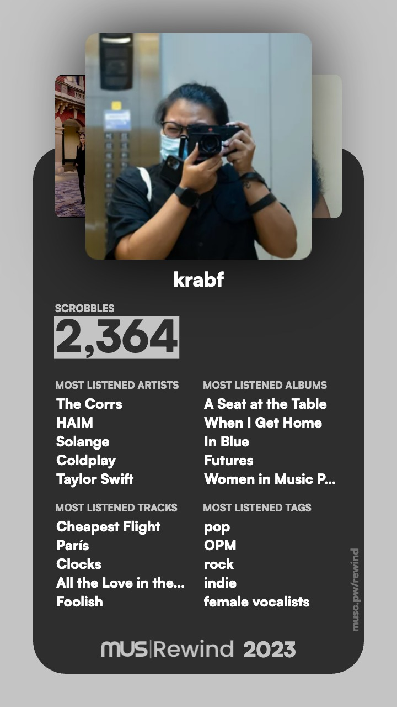
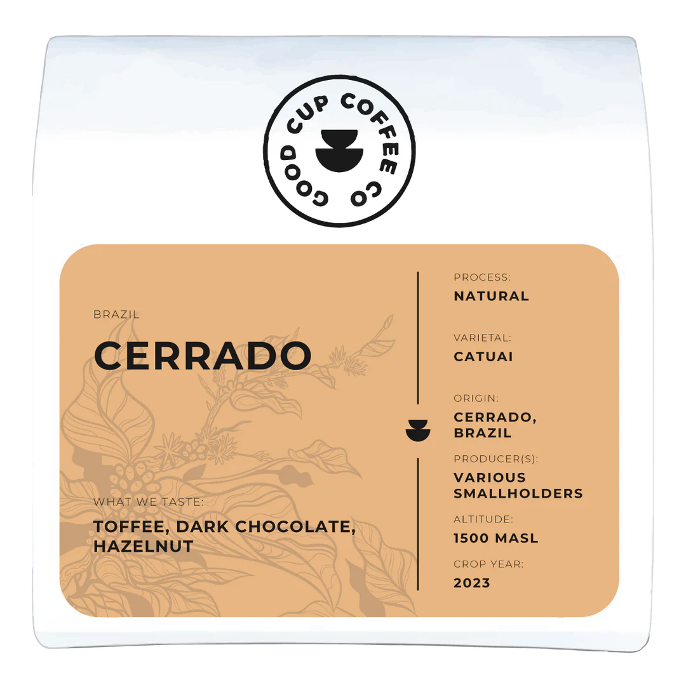

+++
date = 2023-12-30
title = "2023 Media Diet"
slug = "2023-media-diet"
categories = ["Year In Review", "films", "TV", "coffee"]
keywords = ["media diet", "films", "curating", "2023"]
summary = "2023 Discoveries"
+++

My media diet: an eclectic mix of discoveries from 2023, spanning coffee, apps, movies, and everything in between.

## Films

I didn't watch many films this year, but didn't feel guilty about it for the first time. But I plan to go through my watchlist this year and gradually check off each one.

1. Crying Ladies (2003) by Mark Meily
2. Barbie (2023) by Greta Gerwig
3. Oppenheimer (2023) by Christopher Nolan
4. *Kung Paano Hinihintay ang Dapithapon* (Waiting for Sunset) (2018) by Carlo Catu
5. *Kimi no Na Wa* (Your Name) (2016) by Makoto Shinkai
6. Turning Red (2022) by Domee Shi
7. The Swan (2023) by Wes Anderson
8. Cleaners (2019) by Glen Barit ⭐
9. Emily the Criminal (2022) by John Patton Ford
10. Leave the World Behind (2023) by Sam Esmail

## Music

I've been using [last.fm](http://last.fm/) to track the music I listen to. It's interesting to see the different genres I enjoy and how I listen to music.

Here's my [last.fm](http://last.fm/) Rewind 2023 from [Musicorum Rewind](https://rewind.musicorumapp.com/?ref=krabf.com)

The Corrs topped my playlist largely thanks to their unforgettable Manila concert. This year, Taylor Swift became my car soundtrack, courtesy of my niece and cousins who couldn't stop belting out her hits during our karaoke marathons. Despite the Swift takeover, HAIM remained a consistent favorite in my music rotation.

## Coffee

This year, I've mostly stuck to americanos, iced coffee, and espressos, largely skipping filter coffee. Switching to Oatside milk was a game-changer for my coffee experience and there's no going back to Cowhead or Alaska.

For beans, I'm loyal to [The Good Cup Coffee](https://goodcup.ph/?ref=krabf.com), my local roaster in Cebu, and get the [Cerrado](https://goodcup.ph/collections/best-sellers/products/brazil-cerrado/?ref=krabf.com) blend. This beans is a classic choice for an everyday espresso, offering a dependable and rich flavor profile. Notes of toffee bring a gentle sweetness, while dark chocolate adds depth and a touch of bitterness. The subtle hint of hazelnut rounds it out with a nutty creaminess that lingers pleasantly. If you can order this one up online, please do and tell the good folks over at Good Cup that I recommended this to you. This coffee consistently delivers comfort in every cup. A must try!

Not sponsored. Just love all their offerings!

When I need something quickly, Starbucks' Ethiopia blend is my reliable backup. My Singapore coffee adventure introduced me to various kopi styles, leading to a stash of [Old Town coffee](https://www.oldtown.com.my/our-coffee/) and a luxurious encounter with [Bacha Coffee](https://bachacoffee.com/)at the airport.

## Apps, Software, Technology

I'm still mostly in Pinterest and then recently [Are.na](https://www.are.na/) which is just the same as Pinterest but also entirely different at the same time. It's also perfect for collecting and curating stuff you see online.

I tried a new photoset design on my Instagram, you can feel free to check it out [@krabf](https://www.instagram.com/krabf). It's inspired by my *lodi*, senpai, my mentor (nope, he doesn't know), none other than, THE great [Craig Mod](https://craigmod.com/?ref=krabf.com). I like how I can curate the photos that I upload on Instagram more in this manner and it feels less cluttered.

My most used app of the year is [Obsidian](https://obsidian.md/?ref=krabf.com) and [Raycast](https://www.raycast.com/?ref=krabf.com). Switched to [Capture One](https://www.captureone.com/en) to edit my photos. And still using the [Arc Browser](https://arc.net/).

## Blogs & Blogging

I lost track of all the blogs I added to NetNewsWire this year, but a few definitely stood out.  

I blogged more consistently in 2023, with [24 posts](https://krabf.com/blog/) and a few new features added to the site. Along the way, I picked up a lot of Hugo and CSS tricks to make the blog more accessible. It’s not fully automated yet, I’m still doing things manually but I’m happy with the progress.  

Joining [Robb Knight](https://rknight.me/)'s *[Default Apps](https://defaults.rknight.me/?ref=krabf.com)* project was a highlight. It introduced me to some amazing and interesting people online, which was a real bonus.  

Re-discovering [Austin Kleon](https://austinkleon.com/?ref=krabf.com)'s blog and newsletter was a highlight for me. [Aeon](https://aeon.co/?ref=krabf.com) and [What Works](https://www.whatworks.fyi/?ref=krabf.com) became my everyday go-tos. Discovered [The Marginalian](https://www.themarginalian.org/?ref=krabf.com) and resonated a lot with [Be More with Less](https://bemorewithless.com/?ref=krabf.com).

---

That’s pretty much it for 2023. I definitely consumed a lot more, but to spare both myself and you from information overload, I’m sticking to the highlights. I’ll try to do better next year or at least keep track of the details. For now, this will have to do!