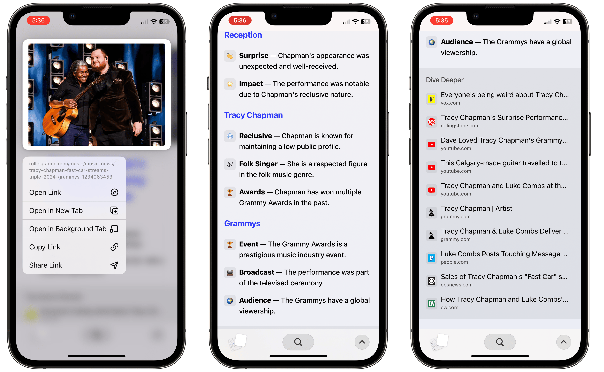
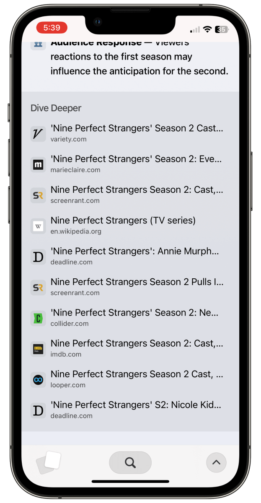

+++
date = 2024-02-15
title = "The Arc Browser"
slug = "the-arc-browser"
categories = ["personal", "technology"]
keywords = ["The Browser Company", "Arc Browser", "Arc Search", "Josh Miller", "Google"]
summary = "Rant on Arc Browser/The Browser Company"
image = "the-arc-browser.jpg"
+++

I am currently undecided between browsers. I have a love/hate relationship with Safari, and Chrome is a power hog because I use Adobe everyday. Although Firefox is great, it tends to be slow. And with the recent [news](https://techcrunch.com/2024/02/13/mozilla-downsizes-as-it-refocuses-on-firefox-and-ai-read-the-memo/?guccounter=1) that they're going to fire 60 people to “focus on bringing "trustworthy AI into Firefox." And Edge? Let's not go there. But then there's Arc, the new contender that's disrupting the browser space. It exceeds the competition with an array of built-in capabilities that provide a seamless browsing experience. Peek, for instance, is wonderful. I've used Arc for two years without even tapping into the AI perks in Arc Max

Arc was a breath of fresh air when I first tried it in 2022. The developers clearly sweated the small stuff to elevate browsing. Browsing vertically was a game-changer; it aligned perfectly with how my brain processes information from left to right and finding and keeping track of my opened links became much easier.  

Arc's way of delivering major upgrades through videos is definitely gimmicky, and cringey, but I dig them. It's just refreshing to see a tech company take an artsy approach for once instead of the usual dry press release. I particularly liked their video released last December called "[We're not building a web browser](https://youtube.com/watch?v=u2-d5Sty-K0)." It had these fun Succession-meets-The Bear vibes. I have to commend them for their artistic approach to showcasing what they're working on through these videos.

In that video, Josh Miller expresses strong dissatisfaction with the current state of the internet, which he views as being negatively impacted by Google's market dominance in browsers and search technology. However, there is an apparent contradiction given Arc's reliance on the open-source [Chromium](https://arc.net/faq#:~:text=is%20arc%20based%20on%20chromium%3F) browser engine, which is developed and maintained by Google.

During a recent episode of the [Vergecast’s interview](https://www.theverge.com/2024/2/6/24063221/ai-search-arc-galaxy-s24-spatial-video-vergecast) with Josh Miller, CEO of [The Browser Company](https://thebrowser.company/?ref=krabf.com), Josh Miller made a thought-provoking point about search engines. He argued that search engines, with their list of links that require active clicking and searching, are not the most effective way to find information. In response, The Browser Company proposes an innovative solution: AI.[^1] This AI would perform a search on your behalf, read multiple links, and generate a concise summary page. In that interview they also talk about their new iOS app called [Arc Search](https://arc.net/blog/arc-search/?ref=krabf.com), the mobile companion that transforms search queries into webpages by browsing and summarizing information from various sources.

*sigh*

I get why some folks want to use AI for all their online searches these days. With so much unreliable info out there, it seems appealing to let algorithms do the sifting for you. But for people who enjoy really digging into research, handing it all off to AI doesn't feel right. Doing your own searching and evaluating sources is part of what makes the process meaningful. AI may or may not point us in the right direction, but it shouldn't replace our own curiosity and critical thinking completely. Sometimes you just need to roll up your sleeves and get into the research yourself to really learn and understand something deeply.

> You can go to Arc on mobile or desktop. And tell Arc what you are looking for and what you're trying to do. And thanks to these Large Language Models we can understand that for the first time and route you to the right place and route you to different things in different ways that wouldn't have been possible before.

We were able to do solid research and find good information long before AI came along. It's not like we were all failing term papers and theses without LLMs! Don't get me wrong, I use ChatGPT too for checking code and grammar. But as handy as they are, these technologies can't replace doing comprehensive searches ourselves. There's value in taking the time to dig into sources, evaluate what you find, and make connections. Sometimes you just have to put in the time yourself to really understand something. These tools are useful assists, but at the end of the day, we still need to rely on our own thinking and effort to do research right.

I was excited to try out Arc's new mobile search app, but honestly, it's been a letdown so far. The "fastest way to search" claim didn't match my experience - it was slow and sluggish in finding results. The info it did pull up often lacked clear sources, so I couldn't even tell if it was reliable. I watched [Matt Birchler](https://birchtree.me/?ref=krabf.com) from [A Better Computer](https://youtube.com/watch?v=-9Pw62MEdfA) give an overview of Arc Search, and I encountered the same issue with the "Browse for Me" feature.

I uninstalled the app the next day because of its sluggishness and it just felt like Google Chrome with haptic features.

But for the purpose of this post, I reinstalled the app and gave it another try. Unfortunately, it is still SLOW. The Browse for Me feature takes minutes and the links don't connect for me — it's like they aren't even considering the quality of sources.

Josh Miller's complaints about Google only providing links during his Verge interview are quite ironic. Arc Search also simply presents users with a collection of links, without additional meaningful or useful information. It's definitely something they need to work on. But for now, acting like this is revolutionary when it's got the same issues as what's already out there? Not cool.  

But the burning question on everyone's mind: How does The Browser Company make money?  Josh Miller keeps saying they're still figuring out their business model. Which leaves me wondering — what happens to our data? With all the AI tech built into Arc, I gotta think they're monetizing our data somehow.

I wish they were more transparent about their plans. As an Arc user, I'm concerned my personal info could be sold without my knowledge. Until Arc explains their revenue plans, I'll have doubts about how they handle privacy. Do they really have users' best interests in mind? Or is our data their product? More openness would go a long way here.

[^1]: This isn't the first AI feature they introduced in the browser. They released a bunch of AI features last October 2023 with [Arc Max](https://arc.net/max)