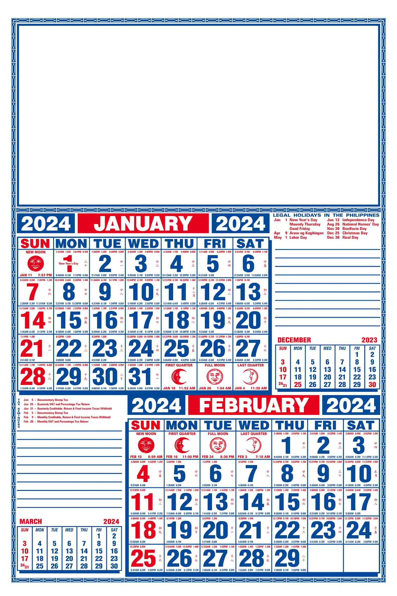

+++
date = 2024-02-23
title = "Adapting to my New Calendar System"
slug = "adapting-to-my-new-calendar-system"
categories = ["personal", "productivity"]
keywords = ["productivity", "calendars", "workflow"]
summary = "A follow up on setting Monday as the start of my calendar week"
link = "https://krabf.com/a-calendar-shift-experiment"
+++

This follow up is already [loooong](https://krabf.com/a-calendar-shift-experiment/) overdue. But just to make things short, I have set every calendar on my devices to Monday.

And I think it has made my life a little bit easier especially now that I am writing Weeknotes. It really gets me excited for the week ahead when Monday feels like a fresh start. I know lots of folks still consider Sunday the start of the week, but for your average 9-to-5er, Monday as day one just works.

That said, it did mess with my head at first. I'd lose track of what day it was and make silly mistakes — like thinking I still had a whole extra day to get my laundry done when really it was Friday! Old habits die hard I guess. As a visual learner who thinks in spatial patterns, the traditional calendar layout with Sunday on the far left visually implies it as the start. This left-to-right orientation positions Sunday as the beginning in my mind. Suddenly shifting the start to Monday disrupted that visual flow and made the calendar layout feel out of sync. So I had a lot of relearning to do in the process of adjusting to this.

Culturally, Sunday has traditionally been the start of the week here in the Philippines and all the customized commercial calendars reflect that. So I don't think it's possible to have the Monday as the start of the week in these calendars.

I'm still adjusting even if it's been months, but overall I'm happy I made the switch.