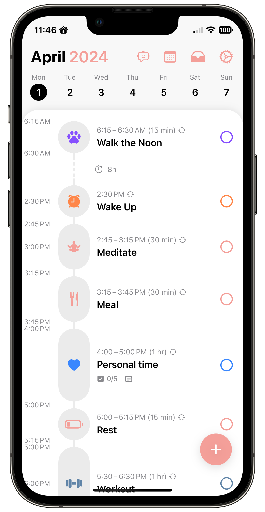
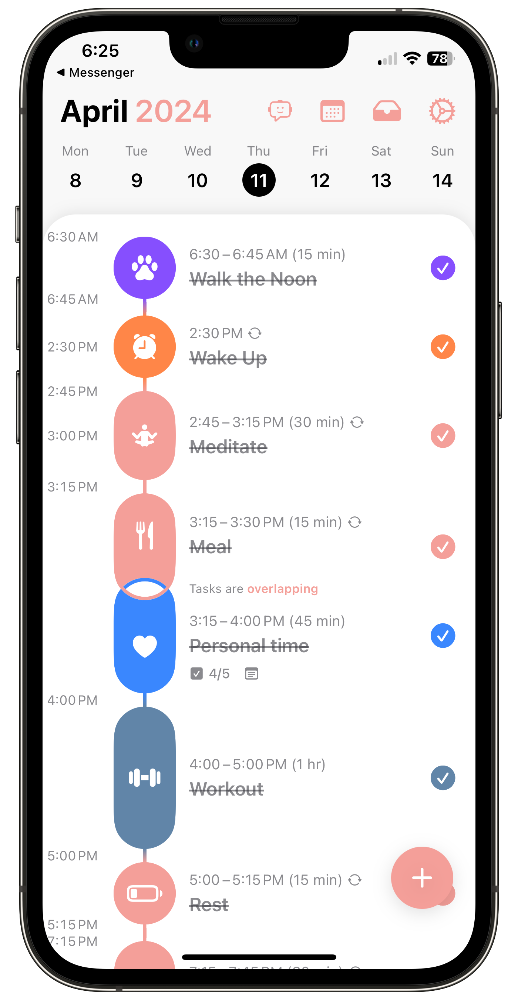

+++
date = 2024-04-15
title = "Structured"
slug = "structured"
categories = ["personal", "productivity"]
keywords = ["productivity", "Structured"]
summary = "Trying out the Structured app"
+++

So I've been trying out this app called [Structured](https://apps.apple.com/us/app/structured-daily-planner/id1499198946) for planning my day more *productively*. It's pretty cool — it basically combines your calendar and to-do lists into one place. But the way I've mainly used it is to block my time for different things I need to do each day. That way I can actually see my daily schedule laid out visually as a timeline, which really helps me plan things out.
 

  

    <figure class="sbs">

<figcaption>Structured block 
</figcaption>
</figure>
  <figure class="sbs">

<figcaption>Structured two weeks of use 
</figcaption>

I first downloaded Structured last month to check it out. And then just this past Friday, I went ahead and paid for the annual subscription. I figured if I'm going to really commit to using it to structure my work week better, I might as well go all in. The hope is that building this daily routine using Structured will help me stay on track over the next 90 days or so.

I've been really struggling to get my body clock adjusted to the new work shift schedule. Having my days mapped out visually might be just what I need to get into a productive groove again. We'll see how it goes! But I'm optimistic that having my days mapped out like this will keep me focused and more productive. If nothing else, it's worth a shot.