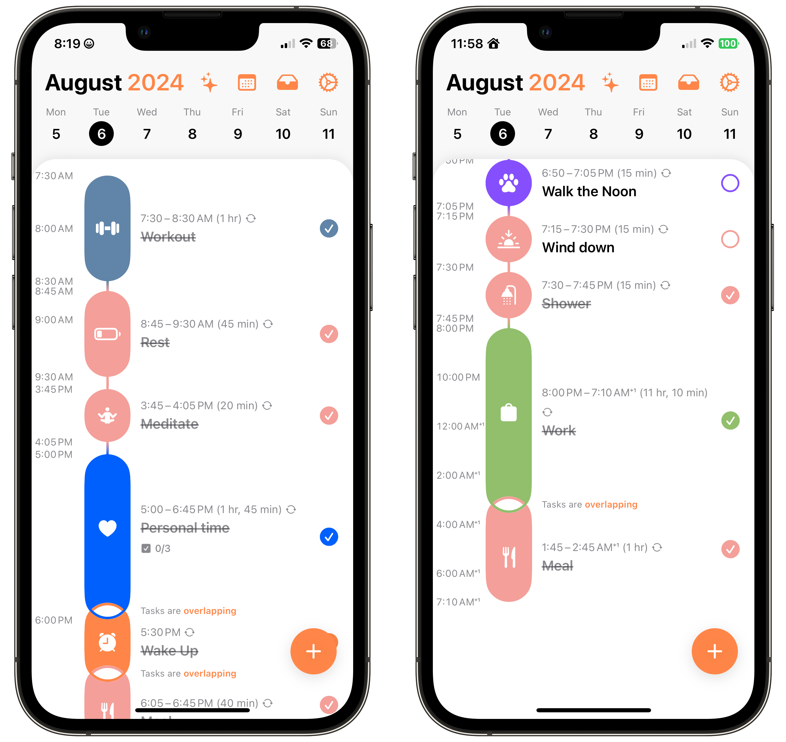
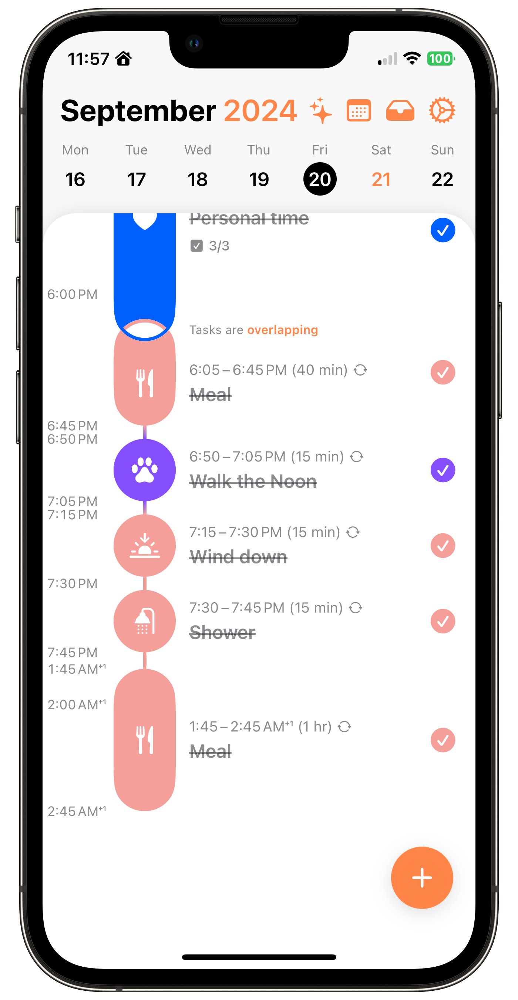

+++
date = 2024-09-21
title = "150 Days with Structured"
slug = "150-days-with-structured"
categories = ["personal", "tools", "productivity"]
keywords = ["Structured", "productivity"]
summary = "Structured app really helped me map out my days"
image = "/blog/2024-09-21-150-days-with-structured/150-days-with-structured.jpg"
ogimage = "150-days-with-structured.jpg"
+++

I've been using [Structured](https://structured.app/?ref=krabf.com) for more than 150 days, and I'm delighted to say that it has significantly increased my productivity. My ability to plan out my days efficiently has greatly improved thanks to the app, and I now have much better time management.

The visual timeline feature really shines. Watching my day unfold visually has reshaped how I tackle my tasks. It’s like having a personal compass for the day, guiding me and keeping me locked into the flow of each task.

Structured has this cool feature where you can set up different tasks for different days, but I've found I love sticking to the same routine every day. It's kinda funny though even with this set schedule, life happens and sometimes I'll have to switch things up because of some "important" thing (let's be real, it's usually not that important). However, the flexibility of the app allowed me to quickly reorganize and reprioritize without feeling like my entire day was derailed.

It's very clear that my time management has gone through [some changes](https://krabf.com/structured/) over the past few months and I'm okay with that since I'm still trying to figure out how to make the most of my day while working the night shift.

May was a rough month. I lost my grandfather, and for about two weeks in June, my whole routine went out the window. When something like that happens, my carefully planned routine just doesn't matter anymore. The weird thing is, though, it didn't mess me up as much as I thought it would. I guess because I knew this wasn't just me slacking off? Life threw me a curveball, and I've got to deal with it. So I just kind of accepted that my structured schedule was going to gather some dust for a bit. It really is okay to step away when you need to.

I love knowing exactly what I'm supposed to be doing tomorrow at this time. It's like I get this weird urge to power through my tasks just so I can tick them off in Structured. I don't know what you'd call this feeling, maybe it's some kind of productivity high? Whatever it is, it gets me seriously pumped up.

I'm glad I took the plunge and committed to the annual subscription. This has definitely paid off in terms of increased productivity and reduced stress. While no app is a magic solution, Structured has provided me with the *framework* I needed to build better habits and make the most of my time.