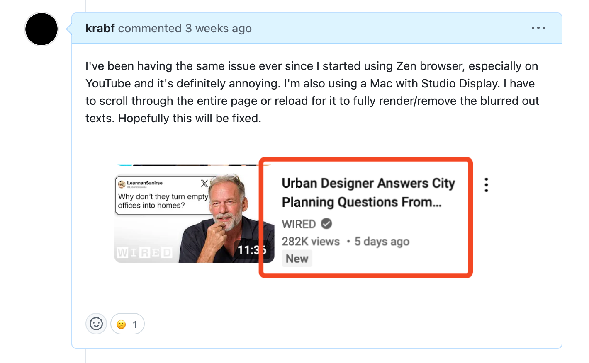
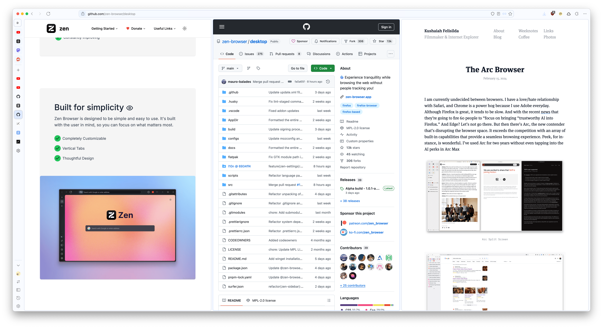

+++
date = 2024-10-18
title = "Zen Browser"
slug = "zen-browser"
categories = ["technology", "internet", "browsers"]
keywords = ["browsers", "Arc", "Firefox", "Zen Browser", "Google"]
summary = "Zen and the art of browser maintenance"
image = "zen-browser.jpg"
+++

I've been on quite a browser journey [lately]([https://krabf.com/the-arc-browser/](https://krabf.com/the-arc-browser/)). I gave Firefox a try, but it encountered problems and felt so clunky that I was forced to do fresh installs in the end just to keep it running smoothly. Eventually, I threw in the towel and narrowed it down to Arc and Safari.

During this time I noticed [Zen]([https://zen-browser.app/](https://zen-browser.app/)) gaining popularity on Reddit and YouTube. So I had to try it out myself and now I've been using Zen as my _secondary_ browser for the past two weeks and I can say that I'm impressed. The developers genuinely seem to value the project, consistently releasing updates that address user feedback, which is refreshing. However, the [pixel density issues]([https://github.com/zen-browser/desktop/issues/440](https://github.com/zen-browser/desktop/issues/440)) were frustrating enough to switch back to Arc and Safari.[^1]  

Just when I thought I had my browser setup figured out, Google rolled out their new [anti-adblock measures for YouTube]([https://www.bleepingcomputer.com/news/google/google-chrome-warns-ublock-origin-may-soon-be-disabled/](https://www.bleepingcomputer.com/news/google/google-chrome-warns-ublock-origin-may-soon-be-disabled/)), and suddenly I couldn't play any videos because of my uBlock Origin and 1Blocker extensions. I tried turning them off and switching to userscripts via Tampermonkey but still had issues. I'm not sure what Google wants to accomplish with this, but I'm not paying for YouTube Premium. I'm already paying for Google One, so I'll stick with that.

I am back to Zen once again, and it seems to be a promising choice given its rapid developments (almost weekly updates!) in the changing browser landscape. The Split Views could still be improved. Right now there's no option to resize or close the tab from the multiple views and there's no indicator on the sidebar which ones are in Split View. Zen is currently in Alpha, so I'm not using any password manager extensions for safety reason. And has some issues, but overall it's a nice browser that is getting better. And it'll be interesting to see how they continue to adapt and potentially shake up the browser market.

[^1]: Zen has then addressed this issue on the [1.0.1-a release](https://zen-browser.app/release-notes#1.0.1-a).