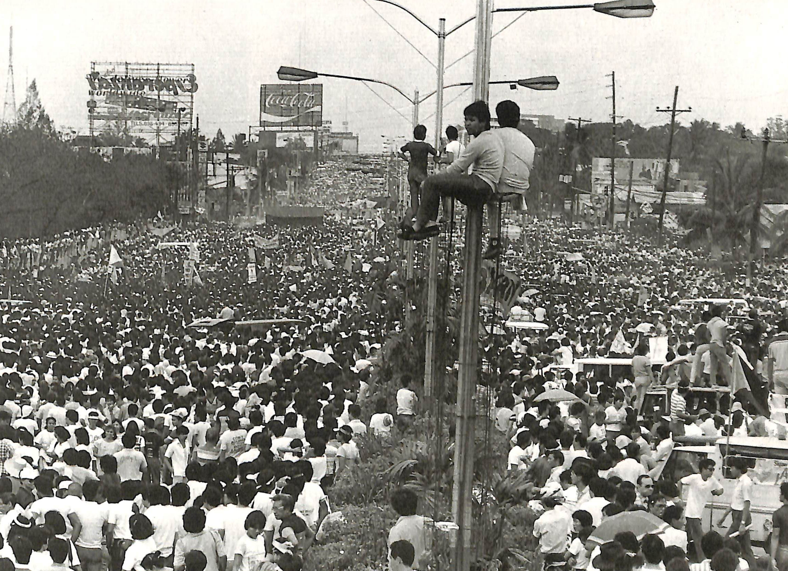
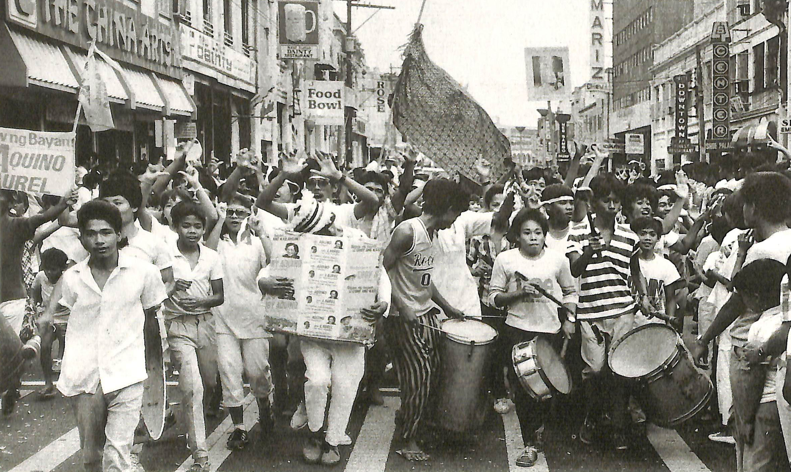
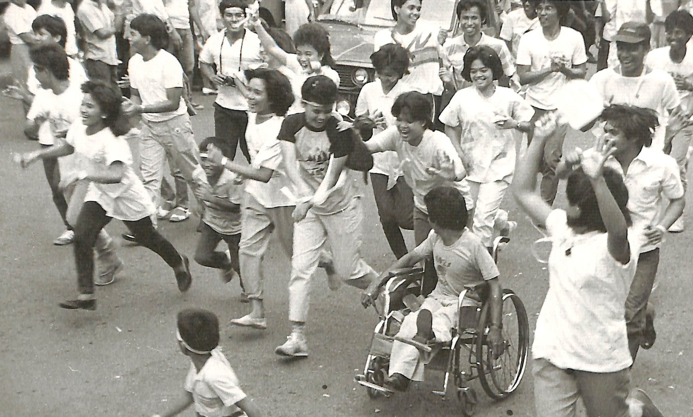
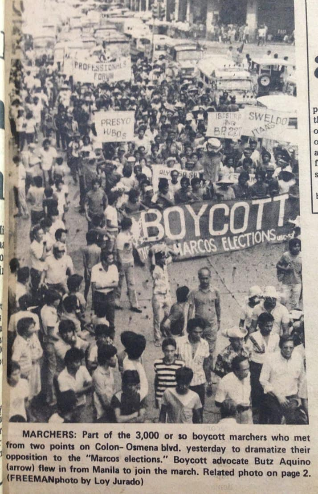
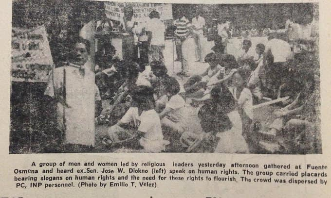
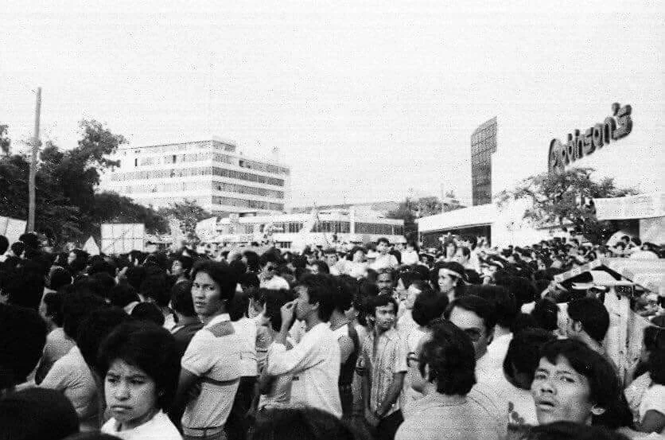
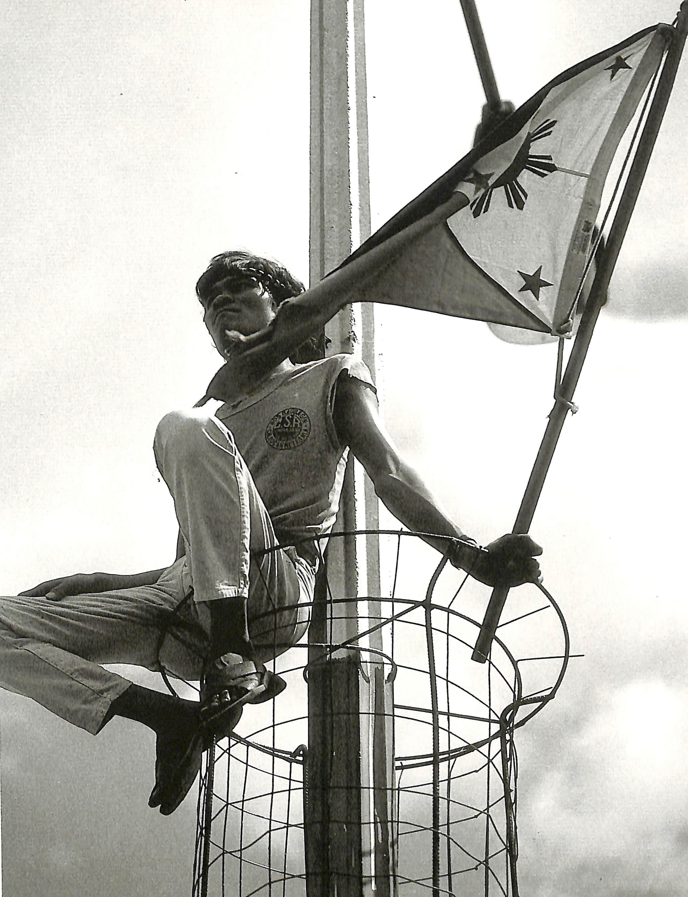
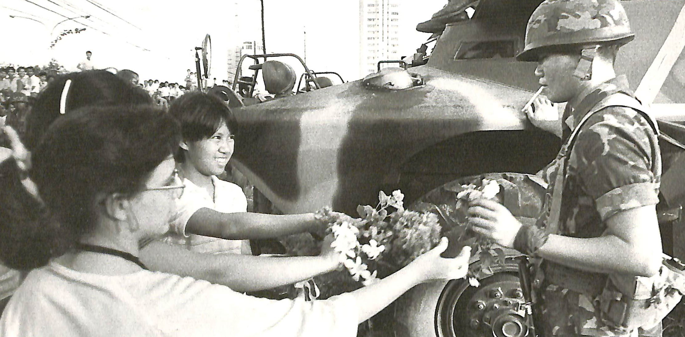
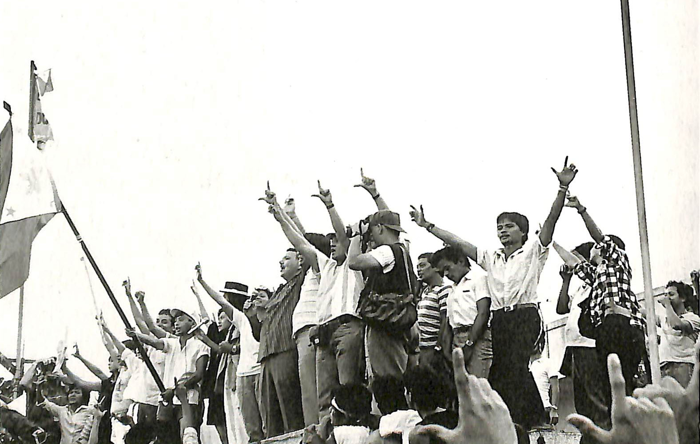

+++
date = 2025-02-25
title = "Go Beyond The Four Walls"
slug = "go-beyond-the-four-walls"
categories = ["rant", "Philippines", "politics", "art"]
keywords = ["EDSA", "People Power Revolution", "Philippines", "Marcos Dictatorship"]
summary = "The People Power Revolution"
+++

A recent encounter made me reflect on how we perceive historical events and social movements in our local context. During a gathering of film students and artists, someone remarked that Cebu doesn’t "really" celebrate the EDSA People Power Revolution because it's "so far away" from Manila, where the main commemorations happen. This perspective surprised and frustrated me. Even within progressive academic circles, there's a disconnect from the rich history of activism in our own city.

The EDSA Revolution wasn’t just a Manila event — it was a nationwide movement that included Baguio, Tarlac, Iloilo, Davao, Bacolod, Cebu. On February 22, 1986, Corazon "Cory" Aquino and Salvador Laurel arrived in Cebu after the controversial snap elections, turning the city into a center of resistance.[^1] Thousands gathered at Fuente Osmeña Circle in a massive show of resistance against the Marcos dictatorship.[^2] Cebu was a bedrock of resistance against the US-backed Marcos Sr. dictatorship, contributing significantly to the broader fight for democracy.[^3]

 

  

    <figure class="sbs">

<figcaption>The Freeman report during EDSA People Power in Cebu 
</figcaption>
</figure>
  <figure class="sbs">

<figcaption>Fuente Osmeña Circle in Cebu during People Power 
</figcaption>

Beyond historical facts, what’s more concerning is the isolation that happens when we confine ourselves to academic spaces and digital screens. Some may not realize that Cebu still have events and mobilizations reflecting the spirit of EDSA. Labor unions fight for workers' rights, environmental groups protect natural resources, student organizations push for educational reform, and cultural workers preserve historical memory. These movements may not always trend online, but they continue shaping our community. [^4]

As students, artists, Filipinos, we’re meant to be keen observers of society. How can we create meaningful art if we’re disconnected from the movements shaping our world? Education doesn’t end at the classroom door — the most valuable lessons in democracy, justice, and engagement come from immersing ourselves in real-world struggles.

So the next time someone says Cebu or cities outside Metro Manila doesn’t celebrate The People Power Revolution, ask: Are we really not celebrating, or are we just not paying attention? The spirit of EDSA isn’t confined to textbooks or social media; it lives in the ongoing fight for justice and democracy happening around us every day.

[^1]: https://verafiles.org/articles/edsa-beyond-edsa
[^2]: https://law.upd.edu.ph/wp-content/uploads/2020/09/UP-IHR-Martial-Law-Album-Plan.pdf
[^3]: https://cebudailynews.inquirer.net/365044/cebu-and-the-days-leading-to-the-edsa-people-power-revolution
[^4]: https://www.rappler.com/philippines/visayas/activists-leads-edsa-people-power-revolution-cebu-february-2023/
 
 
Photos are from the 1986 EDSA People Power Revolution by The Presidential Museum and Library(https://www.flickr.com/photos/govph/albums/72157650893299265/)