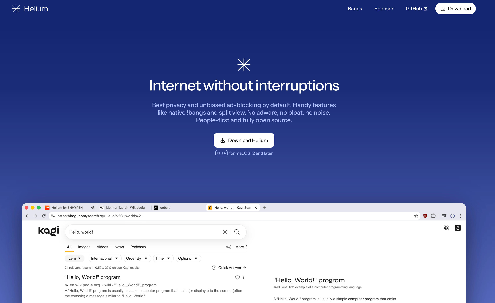
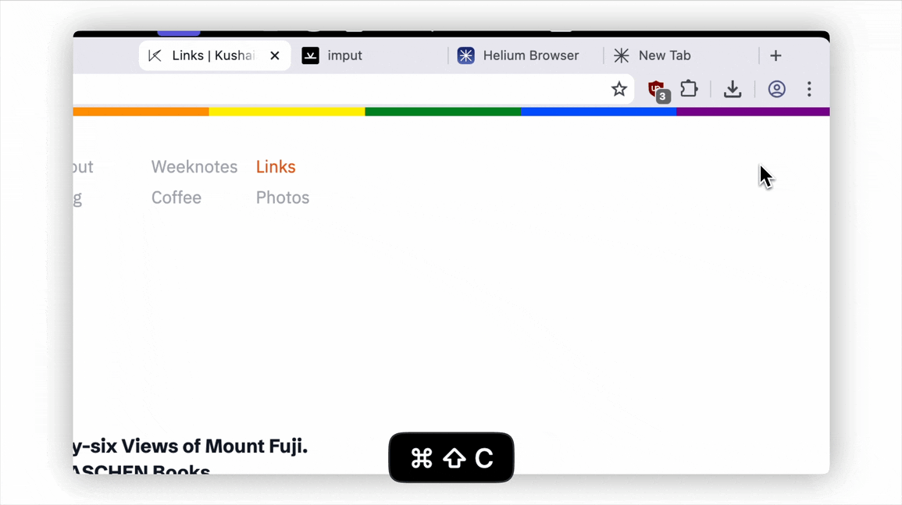

+++
date = "2025-10-24"
title = "Arc Browser Spoiled Me on Vertical Tabs"
slug = "arc-browser-spoiled-me-on-vertical-tabs"
categories = ["tools", "technology"]
keywords = ["vertical tabs", "browsers", "firefox", "AI"]
summary = "Vertical tabs are now my essential"
+++

Arc Browser has completely ruined me. Vertical tabs aren't just a nice-to-have anymore. Now whenever I try a new browser, vertical tab support is the first thing I check.

I've been testing out [Helium](https://helium.computer/?ref=krabf.com), a new browser from [imput](https://imput.net/?ref=krabf.com), the makers of [cobalt.tools](https://cobalt.tools/?ref=krabf.com), and it's really fast. Search results load instantly, and the whole thing just feels snappy. It's privacy-focused too, which is a big plus. Even though it's built on Chromium, they've stripped out all the Google bloat — basically an Ungoogled Chromium that actually *feels* lightweight. uBlock Origin is also enabled by default.

I'm not daily-driving Helium since still in beta and I'm already using Zen most of the time and Arc when I'm coding. Chrome still sticks around because it's the only browser that plays "nice" with every streaming site like Netflix and Disney+. I tried making Chrome my main browser again, but I just can't. I *need* my vertical tabs.

One more thing Arc spoiled me on: the ⌘+⇧+C (Command+Shift+C) shortcut for copying links. It's such a small thing, but now I find myself looking for it in every browser too. I remember creating a shortcut in Safari to replicate it, but that didn't really work out, so I ended up just downloading [Supercopy](https://www.finnvoorhees.com/supercopy/?ref=krabf.com). So I'm glad Helium actually has it too.

I think the main reason I keep gravitating toward Chromium browsers is the extension ecosystem. Most apps and websites have their extensions readily available for Chrome, and I don't really get why Firefox gets left out so often (yes, you [Cosmos](https://www.cosmos.so/?ref=krabf.com)). Firefox is actually a solid browser, and with Arc's recent [downfall](https://www.theverge.com/web/770947/browser-company-arc-dia-acquired-atlassian/?ref=krabf.com), tons of people are jumping ship to Zen anyway. Developers should really be supporting Firefox more.

I haven't really tried the AI browsers out there other than [Dia](https://www.diabrowser.com//?ref=krabf.com), but with OpenAI's [Atlas](https://openai.com/index/introducing-chatgpt-atlas//?ref=krabf.com) now available, I might mess around with it this weekend.

Someone needs to stop me before I turn into a professional browser collector.
