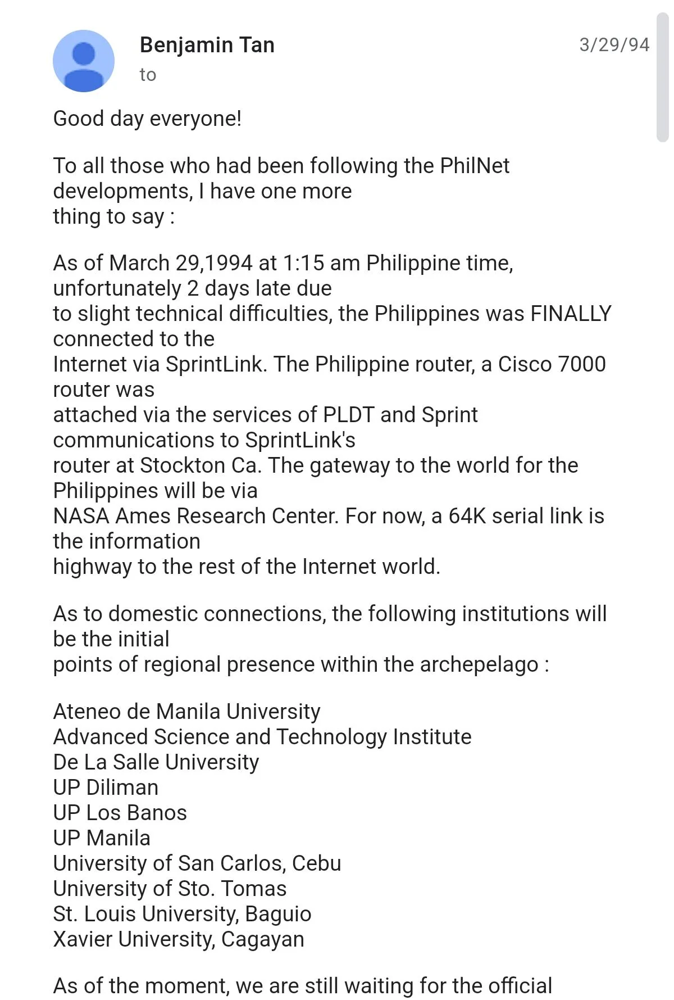

+++
date = 2024-03-31
title = "2024-W13"
slug = "2024-W13"
categories = ["personal", "weeknotes"]
week = "2024-W13 - 25 to 31 March"
summary = "Holy Week, Structured, Marina Summers!!!"
+++

It's Holy Week in the Philippines and with stores closed and everyone either flocking back to their home provinces or squeezing in a long weekend vacation, the whole country feels like it's in transit and at a pause at the same time. This is my first experience having a holiday off from work, and I plan to stay at home. I prefer to stay away from crowds because there’s an ongoing [pertussis outbreak](https://www.rappler.com/philippines/list-cities-provinces-that-declared-pertussis-whooping-cough-outbreak-2024/).

I've been experimenting with a productivity app called [Structured](https://structured.app). It combines your calendars and tasks, but I primarily use it to set a time and duration for my daily schedule, allowing me to have a visual timeline of my day. I downloaded the app two weeks ago and subscribed to the annual plan last Friday to better structure my work week. I am hoping to maintain this routine for the next 90 days!

---

# The Week in Links

📣 [Motherhood aside, Marina Summers won ‘Drag Race’ without winning the crown](https://www.rappler.com/voices/rappler-blogs/opinion-motherhood-aside-marina-summers-won-drag-race-without-winning-crown/) - *Marina won’t need the crown and scepter to rule the drag world. Having already proved her name and brand, she is free to reign the world like the drag queen she was born to be.*

🕸️ [*THE HTML REVIEW*](https://thehtml.review/03/) - is an annual journal of literature made to exist on the web. It is edited by [Maxwell Neely-Cohen](https://maxy.world/) and [Shelby Wilson](https://shelby.cool/) (via Andy Chung of post.cv)

👩🏼 [This week I learned that Dolly Parton originally sang I Will Always Love You](https://kottke.org/24/03/i-will-always-love-you-at-50)

🎙️ [The Tim Ferris Show #728 with Seth Godin](https://tim.blog/2024/03/20/seth-godin-3/)- This was a fascinating discussion about writing, blogging, creative processes, and thinking styles. (via [Swiss Miss](https://www.swiss-miss.com/2024/03/tim-ferriss-and-seth-godin.html))

🌐 [30 years ago, Benjie Tan connected the Philippines to the World Wide Web](https://jimayson.wordpress.com/2011/08/13/the-night-benjie-hooked-up-the-philippines-to-the-internet/) - Benjie Tan quietly made the Philippines' first Internet connection the night before the public announcement on March 29, 1994. Tan worked overnight to set up the router connection to Sprint, celebrating alone with a pizza after making history 🇵🇭

---

</figure>
<lite-youtube videoid="xb9HkiNH0bs" style="background-image: url(&quot;https://i.ytimg.com/vi/xb9HkiNH0bs/hqdefault.jpg&quot;);" class="lyt-activated"><button type="button" class="lty-playbtn">Play</button><iframe width="560" height="315" title="Play" allow="accelerometer; autoplay; encrypted-media; gyroscope; picture-in-picture" allowfullscreen="" src="https://www.youtube-nocookie.com/embed/xb9HkiNH0bs?autoplay"></iframe></lite-youtube>
<figcaption>Such a harrowing, upsetting movie. The sound design is just so magnificent.</figcaption>
</figure>