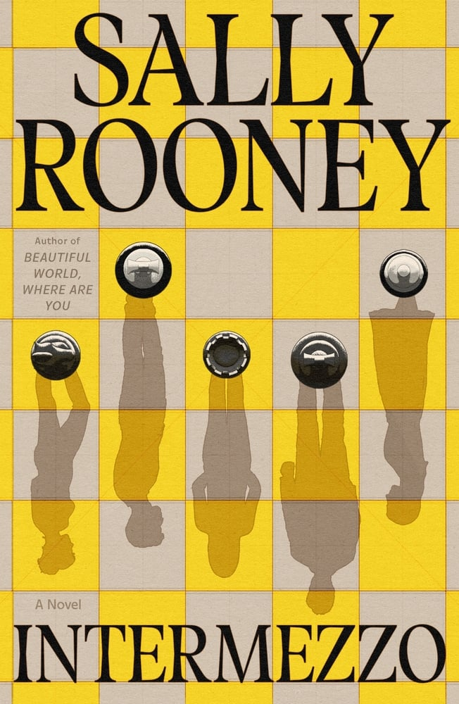
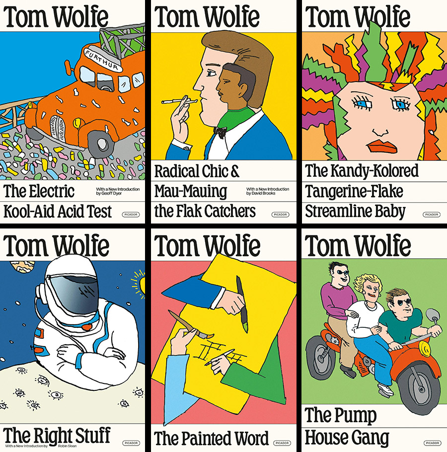
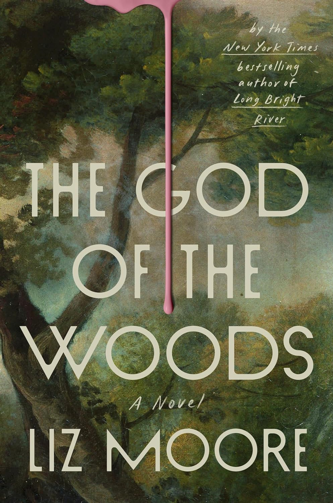
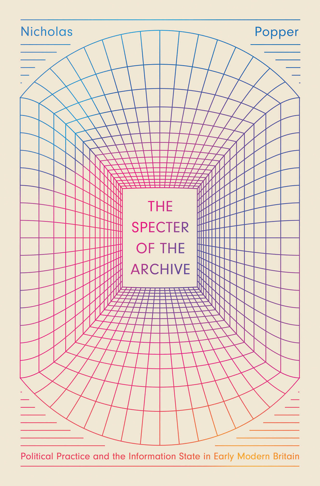

+++
date = 2024-12-22
title = "2024-W51"
slug = "2024-W51"
categories = ["personal", "weeknotes"]
week = "2024-W51 - 17 December to 22 December"
summary = "A Tale of Avian Misery"
+++

Honestly, I don’t understand why people like Carry On. It’s easily one of the worst movies I’ve seen this year. The fact that some people call it enjoyable or even “better” than Die Hard is just beyond me.

Didn't even finish the whole thing. Got so annoyed at one point because Taron Egerton couldn’t keep it together during a "crisis." Like, seriously? The guy trained at the fucking police academy, for Christ’s sake!

Anyway,

This year marks my second Christmas in the city with my partner instead of back home. The quiet feels different — no signature Christmas songs remixed with *[Budots](https://en.wikipedia.org/wiki/Budots)*  blasting through the streets. While I'll miss the family stories and laughter, this feels like the right moment to build my own traditions and shape the life I want.

---

# The Week in Links

✺ [A Blog Directory](https://blogroll.club/)

✺ [Design ideas: e-menu for a food spot](https://blog.readymag.com/design-ideas-for-e-menu/?ref=krabf.com) *by* [Readymag](https://readymag.com/?ref=krabf.com) - I appreciate restaurants that put real thought into menu design. Here in the Philippines, most places stick to basic wall menus above the cashier or bulky menu books crammed with infographic-style layouts. During peak pandemic, I tried launching a fancy e-menu with QR codes in my hometown. The timing wasn't great - most folks weren't ready for digital menus, and not everyone had reliable access to smartphones. A bit ahead of its time, perhaps.  

✺ I may not be an avid reader, but I'm a sucker for great book cover design so here's [Lithub's 167 Best Book Covers of 2024](https://lithub.com/the-167-best-book-covers-of-2024/?ref=krabf.com). Reminds me of one of my favorite artists, [Elisha Zepeda](https://www.instagram.com/ez.bookdesign/).

 

  

    <figure class="sbs">

<figcaption>Intermezzo by Sally Rooney cover design by June Park and Rodrigo Corral, art by June Park  
</figcaption>
</figure>
  <figure class="sbs">

<figcaption>Tom Wolfe paperback reissue series; design by Alex Merto, illustrations by Seymour Chwast 
</figcaption>

 

  

    <figure class="sbs">

<figcaption>The God of the Woods by Liz Moore; cover design by Grace Han  
</figcaption>
</figure>
  <figure class="sbs">

<figcaption>The Specter of the Archive by Nicholas Popper; cover design by Elisha Zepeda 
</figcaption>

✺ [View Your Step History in Weekly, Monthly, and Yearly Summaries with Trends in Pedometer++ 6.2](https://pedometer.app/blog/view-your-step-history-in-weekly-monthly-and-yearly-summaries-with-trends-in-pedometer-62/?ref=krabf.com) - Been testing different step-tracking apps lately. Dropped Pedometer++ last week since it wasn't working for me, and switched to [Stepz](https://stepzapp.com/) and [StepsApp](https://steps.app/). Though I might give Pedometer++ another shot, their new update offers a nice bird's eye view of step progress that's got me curious.

✺ [‘Silo’ to End With Season 4 as Apple TV+ Renews Series for Two More Seasons](https://variety.com/2024/tv/news/silo-renewed-season-3-ending-season-4-1236249072/) - I flew through Season 1 in three days. I couldn't get enough! But Season 2? It's dragging. The plot feels predictable, and the constant back-and-forth between flashbacks and present day is more confusing than clever. I'm still watching, but at a much slower pace since it's lost that spark.

✺ [Man who claims he invented bitcoin faces prison after filing $1.1 trillion suit](https://arstechnica.com/tech-policy/2024/12/judge-rejects-craig-wrights-1-1-trillion-lawsuit-claiming-rights-to-bitcoin/) - Stupid.

✺ [The 12 Days of Christmas - A Tale of Avian Misery](https://vimeo.com/195030004) Written by Craig Ainsley, Narrated by Phoebe Waller-Bridge, Animation by Anomaly *via* [Chris Glass](https://chrisglass.com/?ref=krabf.com). A gem for Christmas.

---

   
<figcaption>A Charlie Brown Christmas [2012 Remastered & Expanded Edition]</figcaption>
</figure>

