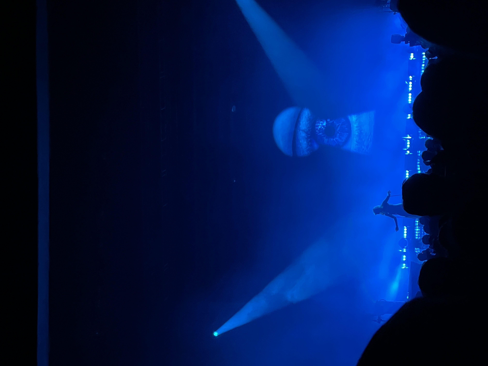
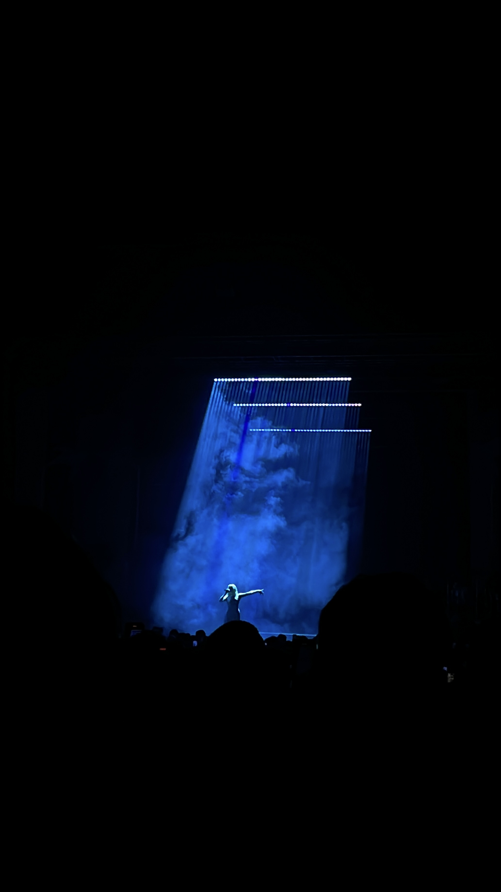
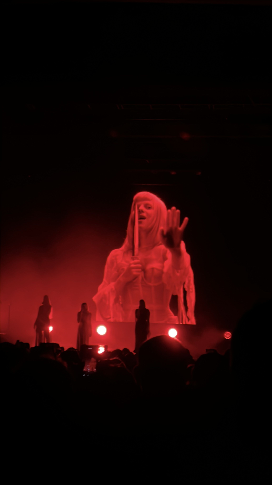
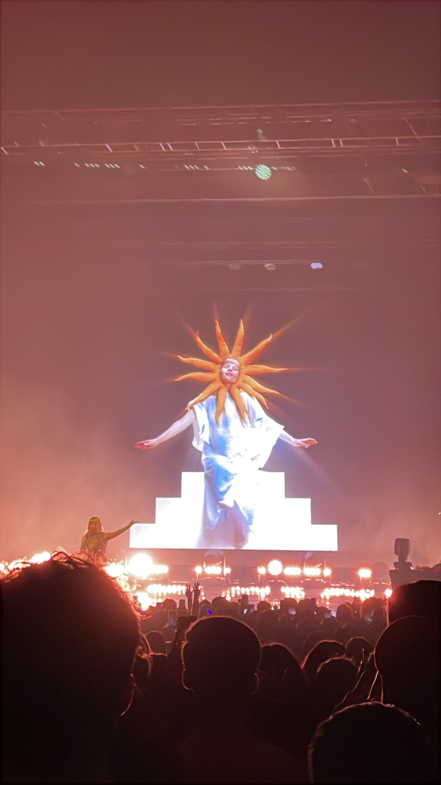

+++
date = 2025-02-02
title = "2025-W05"
slug = "2025-W05"
categories = ["personal", "weeknotes"]
week = "2025-W05 - 27 January to 2 February"
summary = "January felt like forever!"
+++

January felt like it lasted forever — typical of a month where everyone's testing out their "new year, new me" plans. I do things a bit differently though. February is my real start to the year, since January is when I wrap up all my loose ends from the previous year. Call it odd, but it works for me. What's really throwing me off is how 2025 has already packed so much into its first quarter. The world feels like it's moving at hyperspeed, with [one](https://www.wsj.com/tech/ai/oh-dear-did-someone-steal-something-from-openai-8e8a267c?mod=panda_wsj_author_alert) [major](https://www.aljazeera.com/opinions/2025/1/31/elon-musk-is-the-x-factor-in-the-new-trump-administration) [event](https://www.aljazeera.com/program/newsfeed/2025/1/30/video-shows-moment-us-passenger-plane-collides-with-helicopter) [after](https://www.rappler.com/newsbreak/data-documents/charts-adolescent-pregnancy-philippines/) [another](https://variety.com/2025/awards/news/karla-sofia-gascon-offensive-tweets-emilia-perez-1236291811/). We're barely into the year, and it's already exhausting trying to keep up with everything happening.

So, I had the privilege of seeing AURORA last January 31st. I wasn't planning on going, but my cousin's a massive fan. And it was AURORA's first time in the Philippines and the ticket prices weren't too brutal, so I figured why not tag along? Best spontaneous decision ever. That concert was something else entirely. AURORA has this otherworldly presence on stage — the way she moves, the way she sings, it's like nothing I've seen before. The lighting was perfect, visuals were amazing, but it was her voice that got me. Found myself tearing up more than once during the show. She has this way of pulling you into her world, creating this atmosphere that feels both powerful and magical. I went in as a casual listener and left completely spellbound. Definitely setting the bar high for concerts in 2025.

Sorry (not sorry) for the low-quality pictures! Enjoyed too much that had to dance with every song.

  

    <figure class="sbs">

<figcaption>Soulless Creatures</figcaption>
</figure>
  <figure class="sbs">

<figcaption>The Seed</figcaption>

 

  

    <figure class="sbs">

<figcaption>When The Dark Dresses Lightly</figcaption>
</figure>
  <figure class="sbs">

<figcaption>Some Type Of Skin</figcaption>

