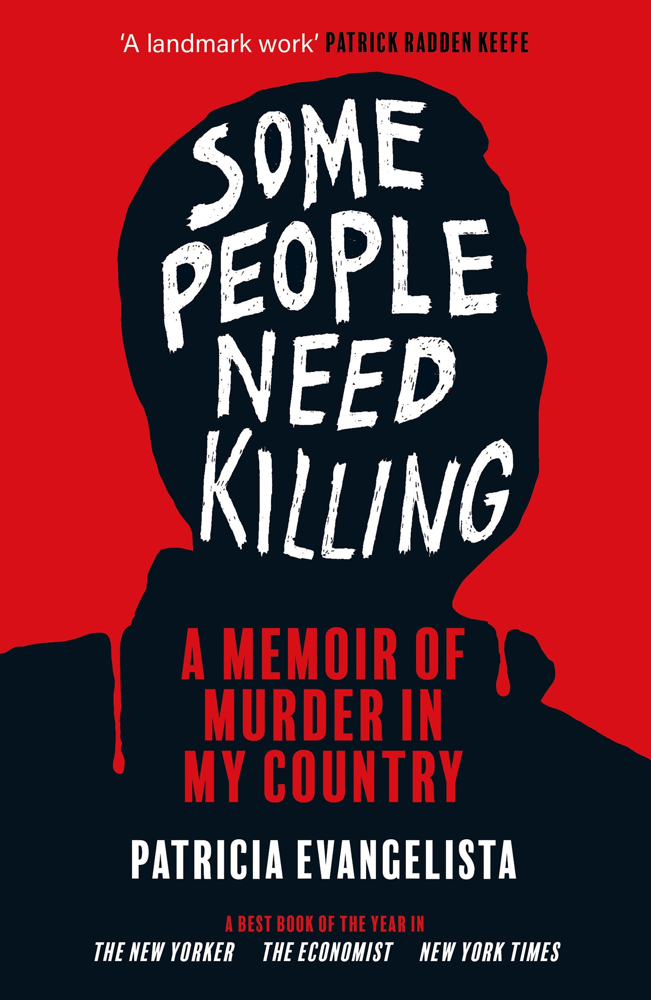

+++
date = 2025-03-23
title = "2025-W11"
slug = "2025-W11"
categories = ["personal", "weeknotes"]
week = "2025-W11 - 10 March to 16 March"
summary = "Dutertard"
+++

> [Former Philippines President Rodrigo Duterte's arrest by the International Criminal Court](https://apnews.com/article/duterte-icc-drugs-court-philippines-hague-cb071416b50227275c42932c471dc0b7) was something I've been waiting to see for years. After all his controversial [drug war policies](https://www.hrw.org/tag/philippines-war-drugs) and those thousands of extrajudicial killings between 2016-2022, it feels like accountability and justice might finally be happening.

[*Read more*](https://krabf.com/on-dutertes-arrest/)

---

# Further reading

🔗 [Philippines: Duterte Arrested on ICC Warrant](https://www.hrw.org/news/2025/03/12/philippines-duterte-arrested-icc-warrant)

🔗 [Inside President Rodrigo Duterte’s brutal antidrug campaign in the Philippines, our photojournalist documented 57 homicide victims over 35 days.](https://www.nytimes.com/interactive/2016/12/07/world/asia/rodrigo-duterte-philippines-drugs-killings.html)

---

<h2>Some People Need Killing: A Memoir of Murder in My Country</h1>
<h3>By <a href="https://patriciaevangelista.com/">Patricia Evangelista</a></h2>

   

 
"Some People Need Killing: A Memoir of Murder in My Country" by Patricia Evangelista is a powerful, deeply personal account of the Philippines’ war on drugs under President Rodrigo Duterte. The book offers a detailed, human-centered perspective on the violent campaign that led to thousands of deaths, often without due process. Evangelista, a trauma journalist and documentary filmmaker, recounts the harrowing stories of victims, families, and perpetrators, exploring how fear, justification, and complicity permeated Filipino society. The title itself echoes the chilling justification of a vigilante who claimed, “Some people need killing,” capturing the disturbing normalization of extrajudicial killings. Evangelista’s work critically examines the human cost of Duterte’s anti-drug crusade, revealing the psychological and moral toll on the nation. The book has been widely acclaimed, earning spots on multiple "Best of 2023" lists and winning the 2024 Helen Bernstein Book Award for Excellence in Journalism.