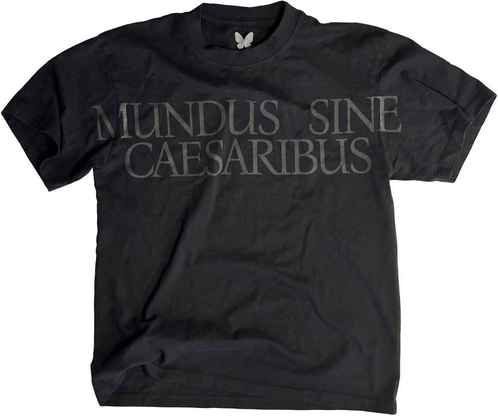
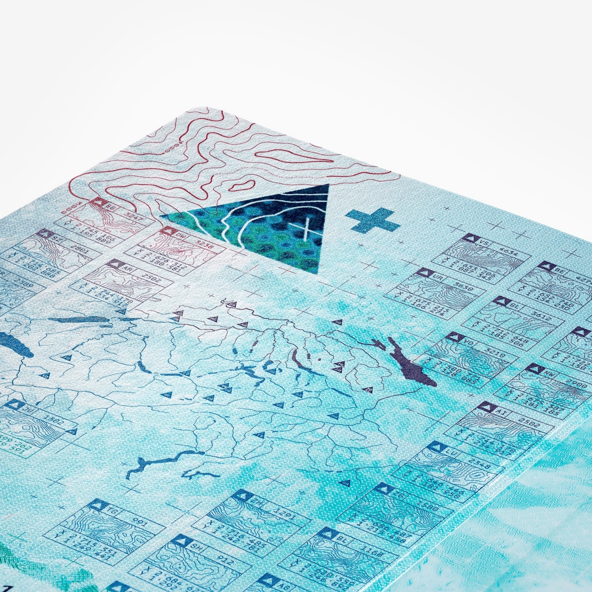
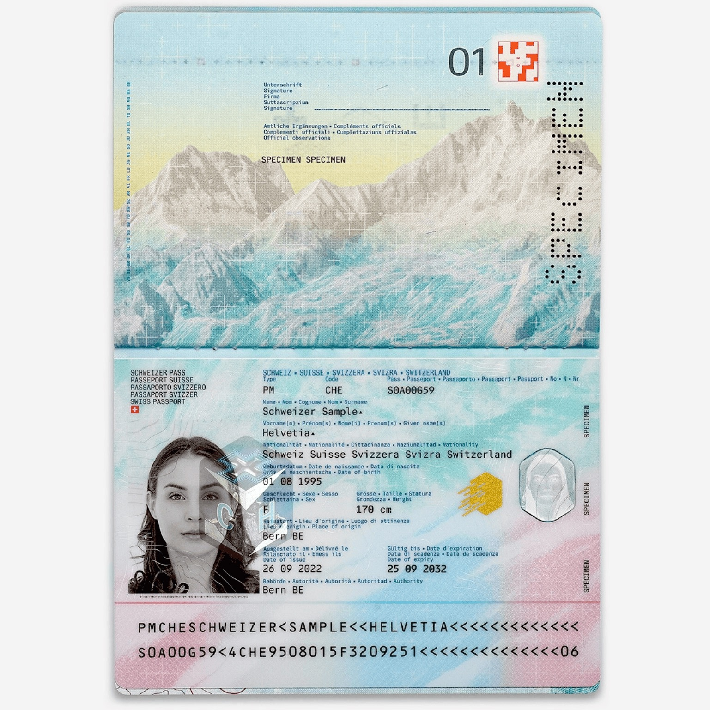
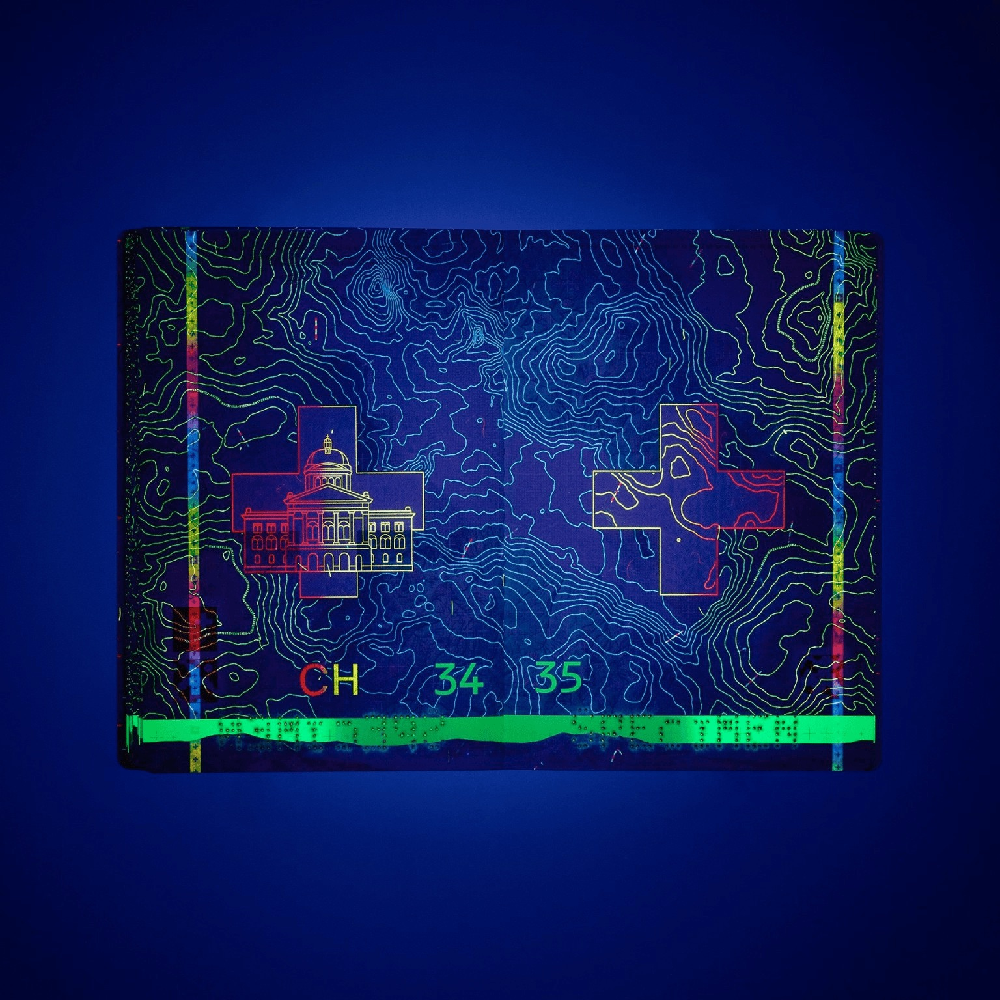

+++
date = 2025-03-30
title = "2025-W13"
slug = "2025-W13"
categories = ["personal", "weeknotes"]
week = "2025-W13 - 24 March to 30 March"
summary = "Mundus Sine Caesaribus"
+++

I’ve been sick since last week, and it’s been rough not being able to stick to the routine I’ve been following for months. It was working almost perfectly for me. I’ve never been a tea drinker, but I had to give in this time.

---

# The Week in Links

✺ [The Age of the Double Sell-Out](https://culture.ghost.io/the-age-of-the-double-sell-out/?ref=krabf.com) *by* [Culture: An Owner's Manuel (David Marx)](https://culture.ghost.io/?ref=krabf.com)

✺ Jay Graber. BDE. 100%. [I want one](https://worldwithoutcaesars.com/). NOW! Please restock.

✺ [Operating Rules for Email Collaboration](https://nazhamid.com/journal/email-collaboration/?ref=krabf.com) *by* Naz Hamid — This is exactly how it should be. The example even matches my ideal for how feedback should be given over email. I honestly want to send this to my clients. I try to make things easier for both of us by sending Frame.io links, but some people are just stuck on writing feedback in emails, and they’re not great at it. This is how it *should* be done.

✺ [Statistically, When Will My Baby Be Born?](https://maggieappleton.com/birth-probability/?ref=krabf.com) by Maggie Appleton — Just amazed at how this is made.

The Swiss government unveiled a new design for its passport, created by Geneva-based studio [RETINAA](https://retinaa.ch/work/new-swiss-passport/?ref=krabf.com). The passport features intricate 3D-modeled reliefs of Switzerland's landscapes, custom typefaces, and security features that use water as a recurring theme to symbolize movement and connection. The color palette shifts through a gradient inspired by the country's diverse landscapes, and under ultraviolet light, hidden details emerge, creating a layered, interactive experience. It is so beautifully made. I want to see and hold one in person.

")

✺ [Are the apps on your phone helping you live an intentional life focused on the things that matter most—or distracting you from it?](https://www.becomingminimalist.com/phone-helping-or-hurting/?ref=krabf.com)

✺ [Taking an Internet Walk](https://syllabusproject.org/syllabus-for-taking-an-internet-walk/?ref=krabf.com) *by* [Spencer Chang](https://syllabusproject.org/spencer-chang/) and [Kristoffer Tjalve](https://syllabusproject.org/kristoffer-tjalve/) - Love this. I live for the term and it's usually what I do. Friends and family often ask why I much prefer using my laptop than the phone. This is mainly because I go deep down the rabbit hole of an internet walk and sure, I could save things to my read-it-later, but there's something deeply satisfying about exploring the web on a bigger screen with multiple tabs branching in different directions. The phone just can't match that experience.

---

<lite-youtube videoid="Cedj8AKI2U8" style="background-image: url(&quot;https://i.ytimg.com/vi/Cedj8AKI2U8/hqdefault.jpg&quot;);" class="lyt-activated"><button type="button" class="lty-playbtn">Play</button><iframe width="560" height="315" title="Play" allow="accelerometer; autoplay; encrypted-media; gyroscope; picture-in-picture" allowfullscreen="" src="https://www.youtube-nocookie.com/embed/Cedj8AKI2U8?autoplay"></iframe></lite-youtube>
 
How everything became AI slop