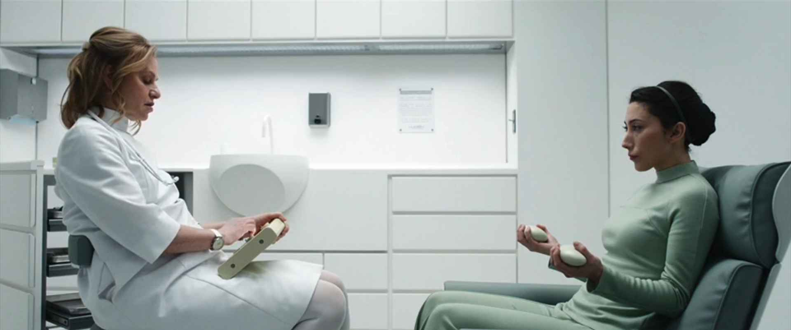
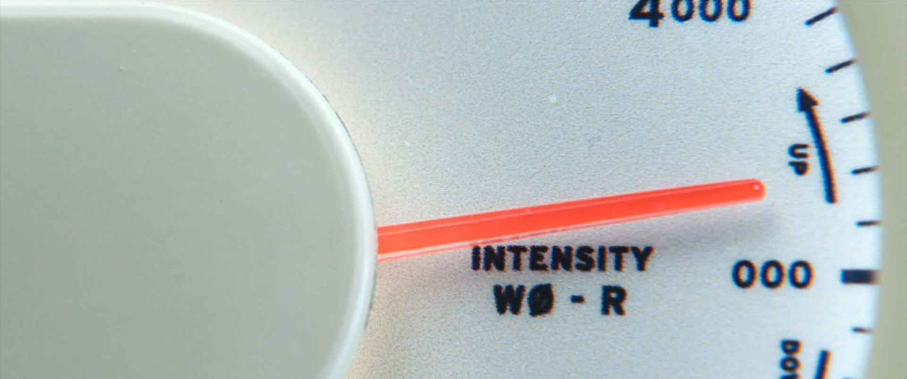
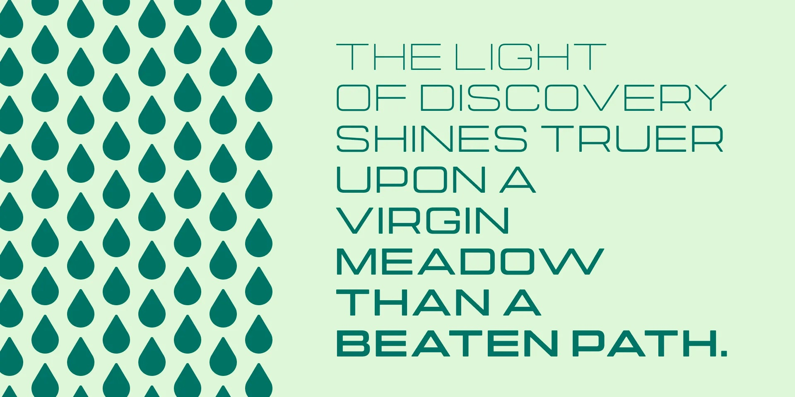
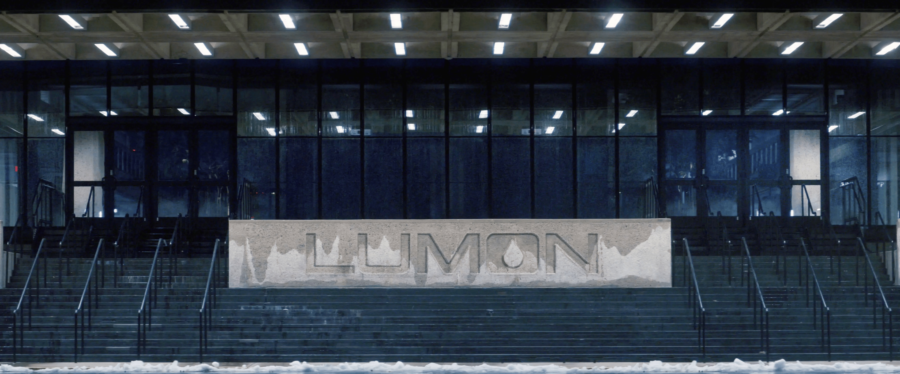
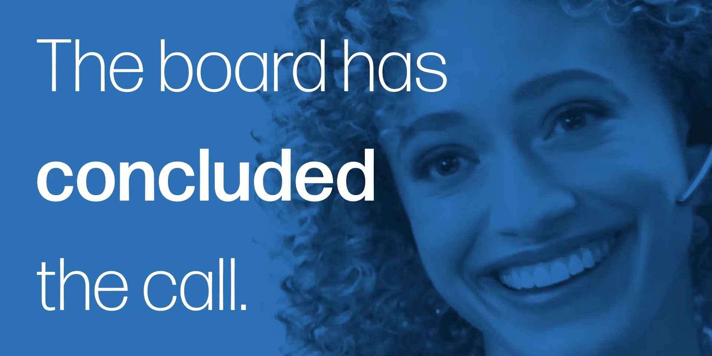
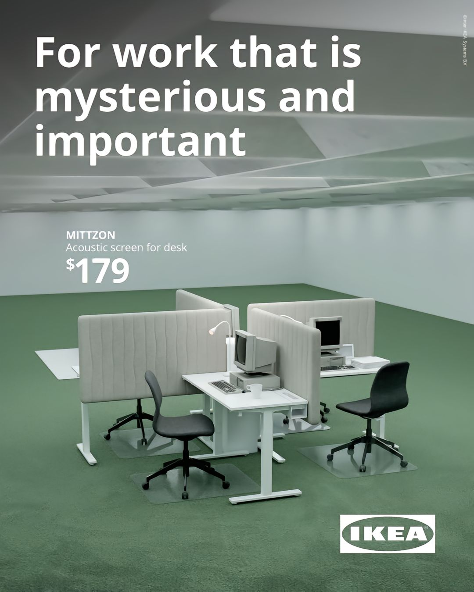
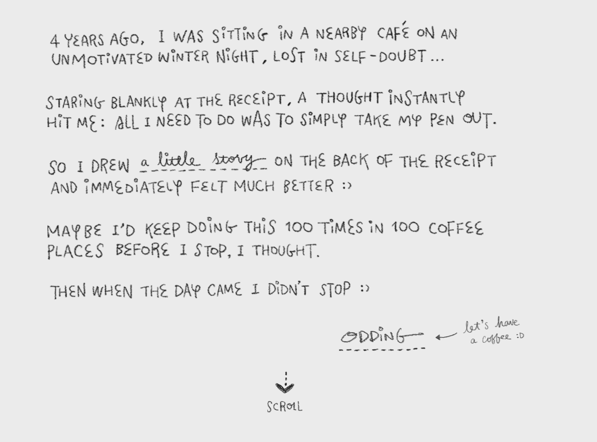
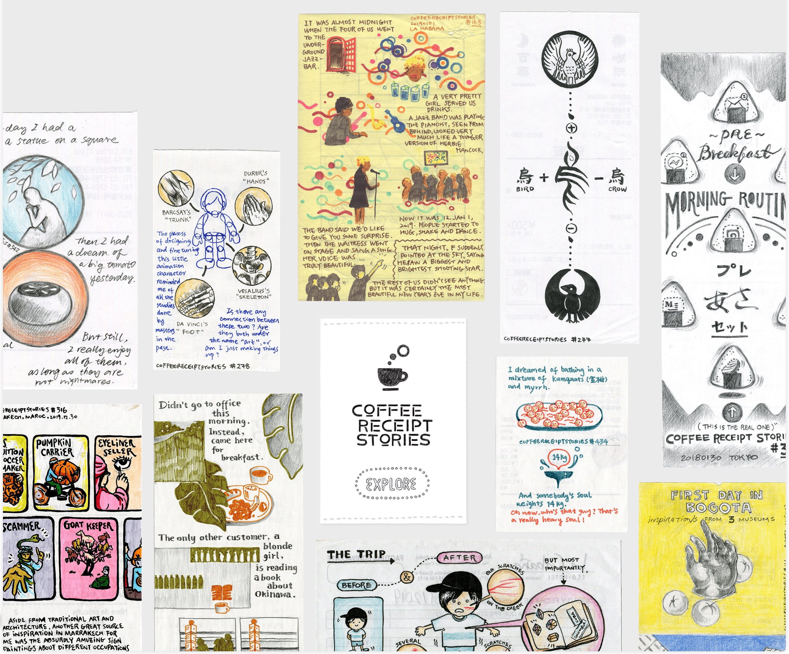

+++
date = 2025-04-06
title = "2025-W14"
slug = "2025-W14"
categories = ["personal", "weeknotes", "TV"]
week = "2025-W14 - 31 March to 6 April"
summary = "Chikhai Bardo"
+++

Just wrapped up Season 2 of Severance, and honestly, I’m not quite on board with the hype it’s been getting. I really enjoyed Season 1 and how it set a strong tone with its eerie minimalism and smart world-building, and it left me genuinely excited for what was next. But this season just didn’t land the same way for me.

The storytelling felt unusually narrow, almost hesitant. There’s a fine line between subtlety and stagnation, and I think Severance drifted too far into the latter. I understand that the show isn’t trying to spoon-feed us the lore around Kier or Lumon, which I respect, but there’s a difference between withholding for intrigue and simply not advancing the narrative in a meaningful way. The pacing dragged, and some arcs felt padded rather than purposeful. The visuals were still great — the sterile production design, the cool-toned palette, and that clinical, locked-down camera style that echoes the characters’ psychological confinement. But good cinematography can't make up for story problems.

One thing I did appreciate was the scenes between Gemma and Mark. Those moments reminded me of "Her" by Spike Jonze; there's something about the way they shoot those montages that captures that same feeling of connection mixed with loss. Quietly devastating, even when the rest doesn’t quite hold up.

---

# The Week in Links

🔗 Bored? [Here's a fun little game for you](https://368chickens.com/).

🔗 [Lumon Industries WoeMeter](https://make3.co/work/woemeter/?ref=krabf.com) - Quick write-up on one of the standout props from Severance Season 2. Seriously, the amount of effort that went into it is wild. Massive credit to the props team (pun fully intended). The level of detail isn’t just impressive! It’s intentional. Everything feels like it belongs in that world, down to the most mundane object. You can tell they’re not just filling space; they’re building layers into the story with every item that shows up on screen.

🔗 [Typography in Severance](https://severance.wiki/typography)

🔗 [Ikea Australia leans Into the ‘Severance’ aesthetic](https://www.famouscampaigns.com/2025/03/ikea-australia-leans-into-the-severance-aesthetic/)

🔗 ["Severance" and Philippine Psychology](https://sikodiwa.substack.com/p/severance-and-philippine-psychology) *by* [Sikodiwa](https://sikodiwa.substack.com)

> In Philippine psychology, this is similar to the dichotomy of loob (interior) and labas (exterior), except that we are more aware of what’s within us. Most of the time, it’s the outie that we try to control through embodied processes such as timpi (to contain) and sikmura (to stomach).

*Timpi* and *sikmura* aren't just practices we consciously choose, they're more like survival instincts that kick in, especially in Filipino work culture where hierarchy and pakikisama often take center stage. You don't always realize you're doing it until you're already deep in it — holding back a reaction in a tense meeting, smiling through a comment that didn’t sit right, or swallowing discomfort just to keep the peace.

🔗 [Coffee Receipt Stories](https://coffeereceiptstories.com/?ref=krabf.com) *by* [Odding](https://oddingwang.com/) - Such a beautiful collection and website! A fun idea too when traveling, if only I could draw like this.

🔗 [How do animals sound across languages?](https://pudding.cool/2025/03/language/?ref=krabf.com) *"How can cultures hear the same physical sounds yet translate them into language so differently?"* Analyzing animal onomatopoeia across languages can demystify how we shape sound into meaning. *by* [Vivian Li](https://pudding.cool/author/vivian-li/)

> If a cow’s moo can interpreted so differently across cultures, how many other sounds might we experience uniquely through our linguistic filters? Whether cows go “moo”, “meuh”, or “음메”, onomatopoeia connects us to the natural world in a way that transcends linguistic boundaries. It invites us to play with sound, to embrace the quirks of language, and to recognize our shared instinct to listen and interpret. In doing so, onomatopoeia reminds us that even the simplest of sounds can tell a universal story, endlessly fascinating in its infinite variations.

🔗 [Markdown and the Slow Fade of the Formatting Fetish](https://ia.net/topics/markdown-and-the-slow-fade-of-the-formatting-fetish/?ref=krabf.com) *by* iA Writer - I love [Markdown](https://daringfireball.net/projects/markdown/syntax/?ref=krabf.com) so much that I wish it worked in every tool. I still forget that some software doesn’t support it all that well.

*Phew! That was a lot of catch up!*

---

<lite-youtube videoid="-2SVRUUyBjA" style="background-image: url(&quot;https://i.ytimg.com/vi/-2SVRUUyBjA/hqdefault.jpg&quot;);" class="lyt-activated"><button type="button" class="lty-playbtn">Play</button><iframe width="560" height="315" title="Play" allow="accelerometer; autoplay; encrypted-media; gyroscope; picture-in-picture" allowfullscreen="" src="https://www.youtube-nocookie.com/embed/-2SVRUUyBjA?autoplay"></iframe></lite-youtube>
 
I have been in [Josh Santana's](https://www.youtube.com/@JoshSantana-e8e) YouTube since last month. They're just so ridiculously good.