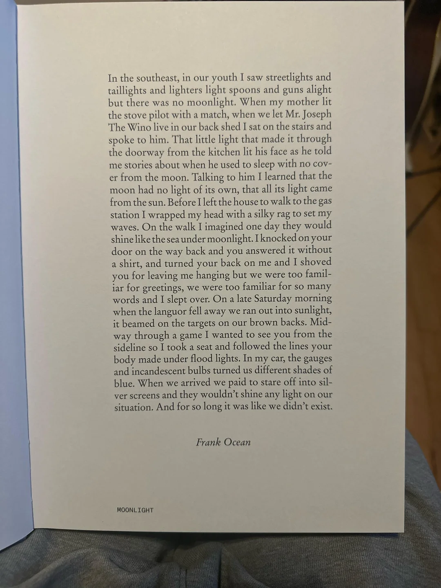
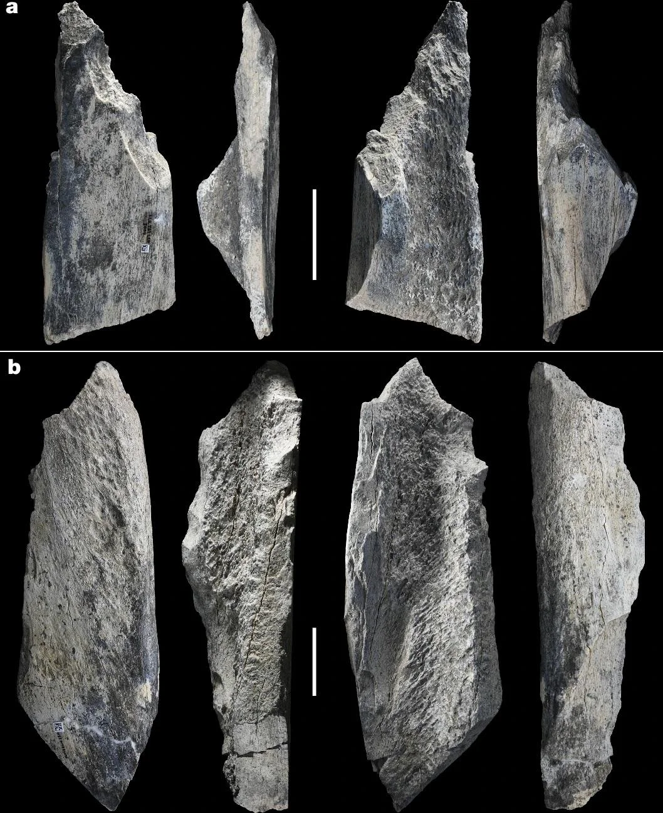

+++
date = "2025-04-13"
title = "2025-W15"
slug = "2025-W15"
categories = ["personal", "weeknotes"]
week = "2025-W15 - 07 April to 13 April"
summary = "Maybe it's time for a change... chz"
+++

Been falling down a rabbit hole of personal blogs lately. With each new site I discover, that little voice in my head gets louder, *maybe it's time for a change*. Pretty ambitious considering I have zero website design skills and wouldn't know where to begin. Perhaps "redesign" is too grand a term — maybe I just want to add a few more pages, something to make visitors curious. But if I'm being honest with myself, this impulse isn't really about others. It's about creating something that feels fully mine. Not entirely sure what I'm chasing here, but the urge to build something personal keeps growing.

---

# The Week in Links

🔗 [How Sonic DNA Connects Generations of Music](https://pudding.cool/2025/04/music-dna/)

🔗 [As the Trump administration purges web pages, this group is rushing to save them](https://www.npr.org/2025/03/23/nx-s1-5326573/internet-archive-wayback-machine-trump)

🔗 [From the FrankOcean community on Reddit: Moonlight Screenplay Book/ Prologue by Frank Ocean](https://www.reddit.com/r/FrankOcean/comments/1jrt7wf/moonlight_screenplay_book_prologue_by_frank_ocean/)

 "Moonlight Screenplay Book/ Prologue by Frank Ocean"

🔗 [1.5-million-year-old bone tools discovered in Tanzania are the oldest ever, reshaping early hominin technology](https://archaeologymag.com/2025/03/1-5-million-year-old-bone-tools-tanzania/) *via* [kottke.org](https://kottke.org/25/03/0046488-archaeologists-have-found)

 "Tools made on long bone diaphysis of very large mammals. Credit: I. de la Torre et al., Nature (2025)"

🔗 [Digital Echoes and Unquiet Minds](https://www.chrbutler.com/digital-echoes-and-unquiet-minds) *by* [Christopher Butler](https://www.chrbutler.com/)

> As more aspects of our lives generate digital echoes, they force an ambient awareness of being perpetually witnessed rather than simply existing. 
> 
> This transforms even solitary activities into implicit social interactions. It forces us to maintain awareness of our “observed self” alongside our “experiencing self,” creating a kind of persistent self-consciousness. We become performers in our own lives rather than merely participants. 

🔗 [In The Year Of A Tree](https://tree.kayserifserif.place/) *by* [Katherine Yang](https://kayserifserif.place/) - Oh my god. I love this so much

🔗 [Keep moving](https://everythingchanges.us/blog/keep-moving/) *by* [Mandy Brown](https://everythingchanges.us/)

> Among the people I’ve witnessed working through crises in their work and lives, the one pattern that comes up over and over again is making art. Art brings us back to ourselves, helps us root in our own agency and creative power, makes space for the joy of craft and play, and reminds us of our purpose in the world. On dark days, it’s easy to think that there’s no room for art, because the work of survival is so demanding. But art doesn’t merely take time—it gives time and [energy back](https://everythingchanges.us/blog/energy-makes-time). It renews our spirits and the spirits of everyone who sees or hears or experiences the art, who receives the art as it’s intended: as a gift.

---

<lite-youtube videoid="-2uwy4MDZ_M" style="background-image: url(&quot;https://i.ytimg.com/vi/-2uwy4MDZ_M/hqdefault.jpg&quot;);" class="lyt-activated"><button type="button" class="lty-playbtn">Play</button><iframe width="560" height="315" title="Play" allow="accelerometer; autoplay; encrypted-media; gyroscope; picture-in-picture" allowfullscreen="" src="https://www.youtube-nocookie.com/embed/-2uwy4MDZ_M?autoplay"></iframe></lite-youtube>