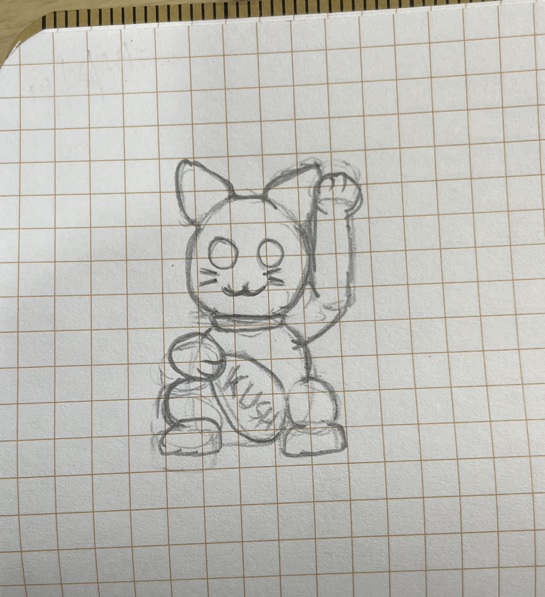

+++
date = "2025-04-20"
title = "2025-W16"
slug = "2025-W16"
categories = ["personal", "weeknotes"]
week = "2025-W16 - 14 April to 20 April"
summary = "If this world were mine"
+++

It’s Holy Week here in the Philippines, and for some of us, it’s been a long weekend of sleeping and bedrotting. I didn’t do anything particularly productive, though we did manage a bit of cleaning — so at least there’s that.

---

# The Week in Links

 🔗 [Jason Santa Maria](https://jasonsantamaria.com/) has refreshed his home in the web

🔗 [Making Software](https://www.makingsoftware.com/) - A reference manual for people who design and build software. Written and Illustrated by Dan Hollick

🔗 [What to Draw and How to Draw It](https://publicdomainreview.org/collection/what-to-draw-and-how-to-draw-it-1913/) *by* Edwin George Lutz *via* [The Public Domain Review](https://publicdomainreview.org/) - This brought back so many memories from when I first started working at my current company. We used to do a lot of creative exercises to keep things fun, and my guy Kyle would always come up with ones just like this. We'd always joke that we didn’t know how to draw (which, to be fair, was mostly just me). Kyle would walk us through it, starting with simple shapes until, somehow, we had a bird hand-drawn on our paper. Another time, we did a maneki-neko, and it was just such a fun thing to draw together.

🔗 [The Secret History of the Manicule, the Little Hand that's Everywhere](https://www.messynessychic.com/2025/03/07/the-secret-history-of-the-manicule-little-hand-thats-everywhere/) - I’ve had this sitting open in a tab for about a week now. The manicule is something I grew up seeing everywhere—books, textbooks, even online, just like the article points out with the mouse pointer (pun intended). But I also think about how much meaning a simple pointing gesture can carry, especially in drag. Whether it’s Bob the Drag Queen’s iconic "purse first!" or just a sharp "shush" motion, a pointed finger can say a lot without needing any words.

🔗 [A 1990s Byron Bay A-Frame Home On The Edge Of Nature](https://thedesignfiles.net/2025/03/homes-laura-muirhead-peter-tanevski-byron-bay) - Some day I'll get a house and make have this as one of my inspiration. This jsut feels "home"

🔗 [Short Trip](https://alexanderperrin.com.au/paper/shorttrip/) *by* Alexander Perrin - I came across this while on a quest to find small web games that help me pause and relax my mind.

---

<lite-youtube videoid="sNY_2TEmzho" style="background-image: url(&quot;https://i.ytimg.com/vi/sNY_2TEmzho/hqdefault.jpg&quot;);" class="lyt-activated"><button type="button" class="lty-playbtn">Play</button><iframe width="560" height="315" title="Play" allow="accelerometer; autoplay; encrypted-media; gyroscope; picture-in-picture" allowfullscreen="" src="https://www.youtube-nocookie.com/embed/sNY_2TEmzho?autoplay"></iframe></lite-youtube>

Kendrick Lamar & SZA - luther
 
I love every bit of this music video. I want to write about it—probably soon, when I have the time. For now, I just want to enjoy it.