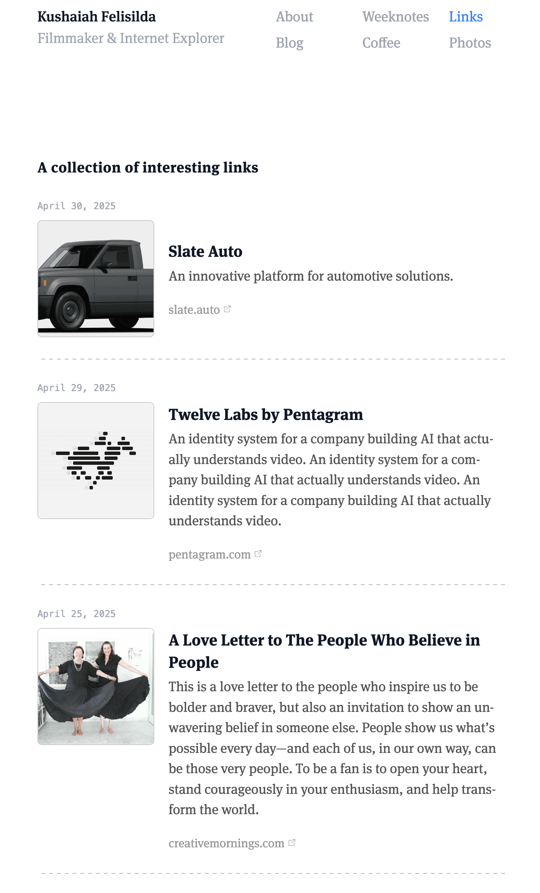
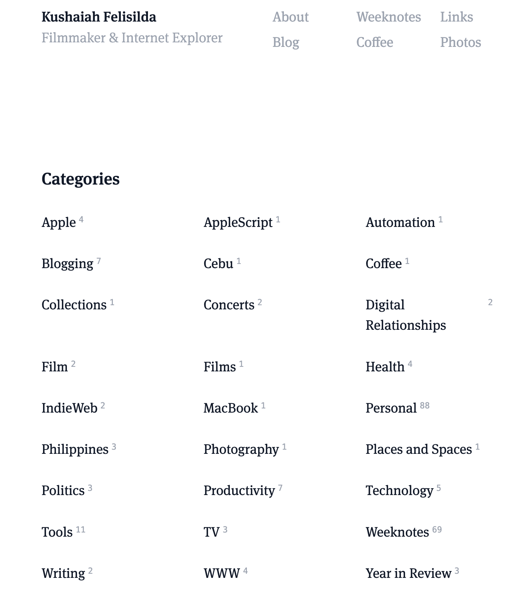

+++
date = "2025-05-04"
title = "2025-W18"
slug = "2025-W18"
categories = ["personal", "weeknotes"]
week = "2025-W18 - 28 April to - 4 May"
summary = "I vibe-coded"
+++

I finally got around to finishing the design of my [links page](https://krabf.com/links/). Spent a solid week tinkering with it, making sure it’s responsive, looks great and so on. And I can finally close down the 30 tabs I have in my browser from all the website that I had some inspiration from. Learning to "vibe-code" in Cursor was surprisingly enjoyable, though it definitely has a learning curve. You can't just throw vague ideas at these LLMs and expect magic. I had to be incredibly specific. Sometimes I'd even ask ChatGPT to help me phrase requests just to make them technical enough for Cursor to interpret correctly.

Still not quite the design I had in mind, but it's a start. My vision for this links page kept shifting as I worked on it — probably because I pulled inspiration from so many different websites. Right now the goal is simply to put it out there and tick it off my checklist. It's a bit of a patchwork right now, but I'll keep refining it until it feels right.

And if you haven’t noticed, I also made a [Categories](https://krabf.com/categories/) page. It was actually the first thing I vibe-coded. Mostly just to get a feel for how it works. Not totally sure if I’ll keep it as-is, but for now, I kind of like having it there.

Claude, though? Probably the best AI I’ve used so far. And the whole “vibe-coder” debate is weird to me. Like, no, it doesn’t suddenly make someone a full-fledged web developer. But it does give non-devs a way to build and experiment, and even actual developers use these tools now. I don’t see the problem. Gatekeeping tools that help people learn and create feels pointless.