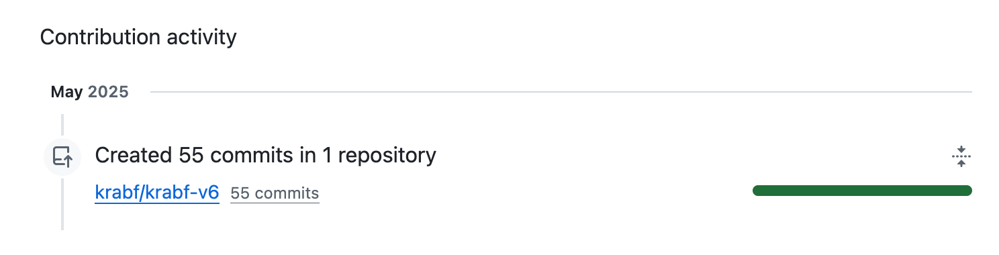

+++
date = "2025-06-01"
title = "2025-W22"
slug = "2025-W22"
categories = ["personal", "weeknotes"]
week = "2025-W22 - 26 May to 1 June"
summary = "Pride! Links! AI! Ruby Ibarra!"
+++

HAPPY PRIDE MONTH, MGA BAKLA! 🏳️‍🌈

I'm celebrating this year's pride by bingeing queer cinema, of course. Got a whole list cooking, just need to get my them organized. But we’re slaying June 1 with [Mickey 17](https://www.themoviedb.org/movie/696506-mickey-17). Let the *bayot-bayot* begin!

Finally cracked the code on my Links page RSS - it's live and ready to share!
If you spotted some *chaotic activity* on my blog recently, that was me building in public while desperately trying to fix this thing. I thought this

Turns out the solution was classic: scrap everything and start fresh. Deleted my custom template, grabbed Hugo's default RSS setup, and spent way too much time figuring out how to add proper footers.

This little project had me pulling my hair out for weeks, but seeing it finally work feels incredible. Another item crossed off the endless website to-do list. The [Links](https://krabf.com/links/) page is up and running, complete with [RSS](https://krabf.com/links/index.xml/) if you fancy.

I think I'm gonna take a break from messing with my website for a bit. This whole Links page thing has me pretty burnt out on coding stuff. Time to actually post in the damn site instead of constantly tweaking it.

---

# The Week in Links

✺ [Arc Browser is officially dead](https://browsercompany.substack.com/p/letter-to-arc-members-2025) - The Browser Company CEO, who has this painful-to-watch "tech visionary" persona, just announced they're ditching Arc to go all-in on AI browsing. The internet is predictably losing its mind, and honestly, most of the anger / confusion / frustration feels justified. Look, I *loved* Arc and still have it installed, but their whole approach has been frustrating to watch. Two years of flashy marketing campaigns that promised the world while features that the users want remained broken or missing. It's been obvious for a while that they care more about impressing VCs and chasing trends than actually building something their users need. The pivot to AI browsing feels like the final confirmation that user feedback was never really the priority. Just another startup chasing whatever's hot instead of perfecting what they already had.

[Manuele Moreale wrote](https://manuelmoreale.com/on-browsers-ai-and-the-web):

> And in the blog post, he even tried to gaslight everyone by saying “That’s why most browsers don’t dare to try new things. It’s too costly. Too complex to break from Chrome”. If that’s the case Josh then explain to me why a project like [Ladybird](https://ladybird.org/) is managing to make progress in precisely that direction with probably a fraction of the manpower and financial resources you had. 

✺ [Sky, natural computing for the Macintosh.](https://sky.app/) Sky is coming this summer. You can read more at [MacStories](https://www.macstories.net/stories/sky-for-mac-preview/). - *via* [The Newsprint (Josh Ginter)](https://thenewsprint.co/2025/06/01/the-sunday-edition-06-01-25/)

✺ [DICT tests prototype of ‘homegrown’ AI model, eyes launch before Sona](https://newsinfo.inquirer.net/2064462/dict-tests-prototype-of-homegrown-ai-model-eyes-launch-before-sona) - 
> *eh bopols na bopols nga ang mga government websites, karamihan puro mali ang logic ng websites lalo na yang eGov na yan. unahin nyo munang ayusin ang mga goverment websites bago kayo mag AI na yan!*

"Our government websites are already so messed up, most of them have faulty logic especially that eGov system. Fix the government websites first before jumping into AI!"

I completely agree with this sentiment. Philippine government websites are notorious for being disasters — clunky interfaces, outdated designs, riddled with bugs, or completely inaccessible. Half the time they load so slowly you'd think they're running on dial-up. Maybe focus on getting basic web infrastructure right before diving into the AI hype train?

---

<lite-youtube videoid="PcPS-21ZVMw" style="background-image: url(&quot;https://i.ytimg.com/vi/PcPS-21ZVMw/hqdefault.jpg&quot;);" class="lyt-activated"><button type="button" class="lty-playbtn">Play</button><iframe width="560" height="315" title="Play" allow="accelerometer; autoplay; encrypted-media; gyroscope; picture-in-picture" allowfullscreen="" src="https://www.youtube-nocookie.com/embed/PcPS-21ZVMw?autoplay"></iframe></lite-youtube>

Ruby Ibarra, 2025 Tiny Desk Contest Winner: Tiny Desk Concert