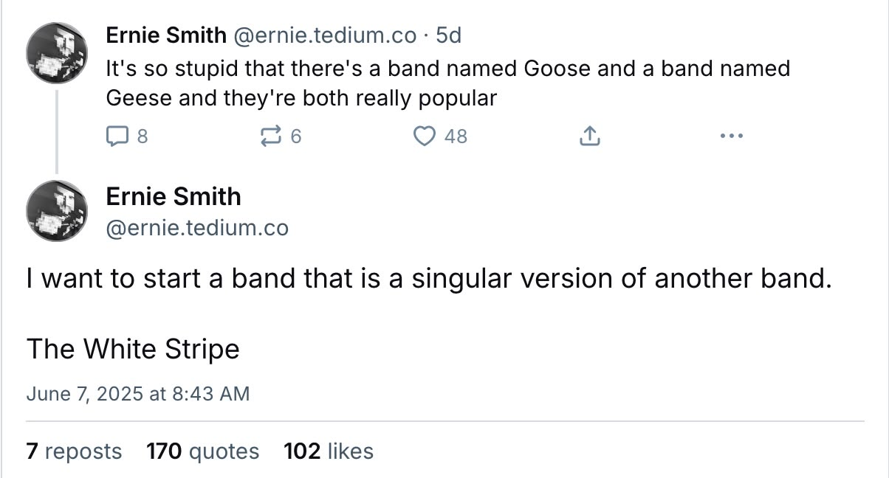

+++
date = "2025-06-08"
title = "2025-W23"
slug = "2025-W23"
categories = ["personal", "weeknotes"]
week = "2025-W23 - 2 June to 8 June"
summary = "Qu'est-ce que c'est?"
+++

Another brutal week. Honestly, the hermit life is looking more appealing by the day. Doesn't help that it's been raining nonstop, the gloomy weather is definitely not doing my mood any favors.

Trying to shake things up with a new hobby though. Just ordered some tools off Shopee (think Amazon, but for Asia) and they should arrive soon. At least it'll give me something to focus on besides everything else going sideways.

---

# The Week in Links

✺ [!Camera](https://notbor.ing/product/camera) by Andy, maker of [Not Boring Apps](https://notbor.ing/) is such a joy to use. The haptics are so satisfying and I have been using it almost everyday. Even my partner loves it.

✺ [Ernie Smith posted:](https://bsky.app/profile/ernie.tedium.co/post/3lqy4kynq722u)

And comments are so hilarious.

✺ In case you missed out on the small things the past few days, the [2025 Tiny Awards nominations are open](https://tinyawards.net/). Tiny Awards nominations just opened. They're all about celebrating the small, thoughtful corners of the web - the creative, handmade projects that bigger awards usually ignore. It's their way of giving personal web projects the recognition they deserve, especially the ones that prioritize craft over commerce.

✺ [Just fucking use HTML](https://justfuckingusehtml.com/) *built by* [@kyrylosilin](https://bsky.app/profile/kyrylo.org)

✺ [Remain in Light: Mike Mills on the films that influenced his Talking Heads video for "Psycho Killer"](https://letterboxd.com/journal/mike-mills-talking-heads-interview-psycho-killer/)

✺ [88x31 Pride Badge Generator](https://badge.les.bi/)

---

<lite-youtube videoid="CJ54eImz88w" style="background-image: url(&quot;https://i.ytimg.com/vi/CJ54eImz88w/hqdefault.jpg&quot;);" class="lyt-activated"><button type="button" class="lty-playbtn">Play</button><iframe width="560" height="315" title="Play" allow="accelerometer; autoplay; encrypted-media; gyroscope; picture-in-picture" allowfullscreen="" src="https://www.youtube-nocookie.com/embed/CJ54eImz88w?autoplay"></iframe></lite-youtube>

Talking Heads - Psycho Killer Directed by Mike Mills
 
Woah, I didn't expect a music video to come out about 50 years late.