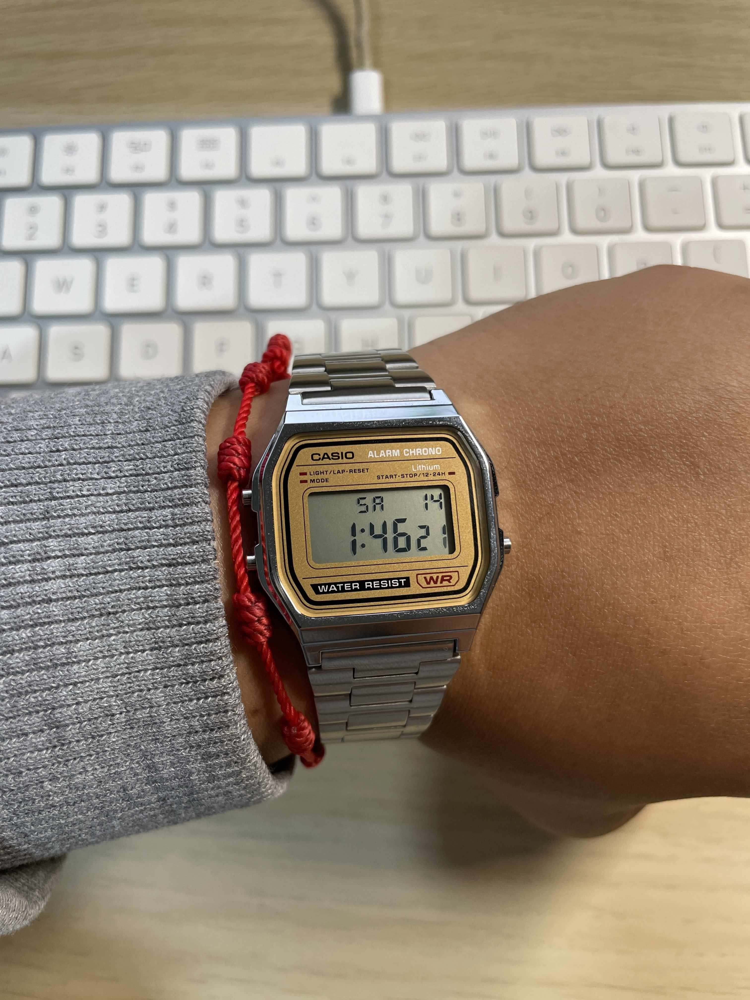
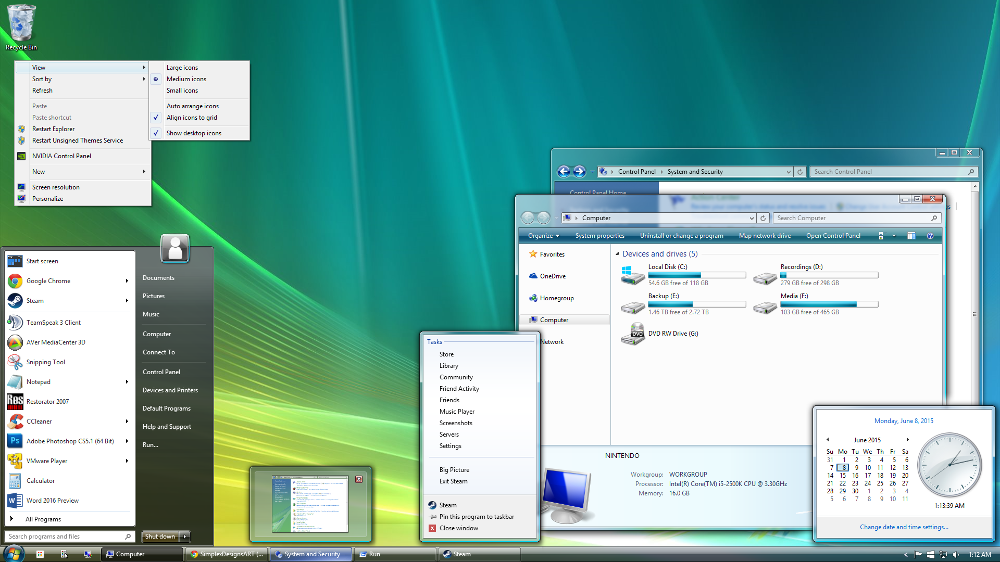
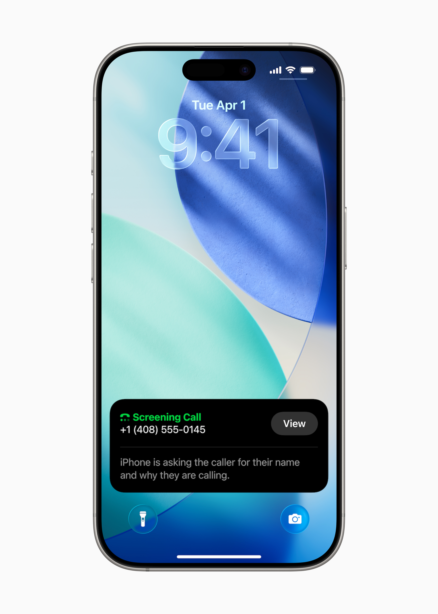
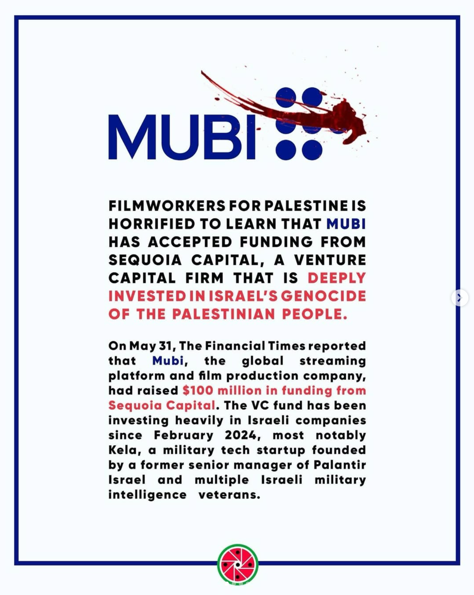

+++
date = "2025-06-15"
title = "2025-W24"
slug = "2025-W24"
categories = ["personal", "weeknotes"]
week = "2025-W24 - 9 June to 15 June"
summary = "Glass"
+++

My Casio A158WEA-9 just arrived, and I'm completely in awe with how delicate and beautiful this little thing is. The watch tools came in too - went with the budget options since I'm just starting out. (Pretty sure I said the exact same thing when I first got into coffee, and look how that turned out.)

<figure> 

<figcaption>Casio A158WEA-9JH 
First wear.
</figcaption>

</figure>

Still in the honeymoon phase with this piece, though the bracelet definitely has sharper edges compared to my beloved A168. The A168 felt comfortable right out of the box and has only gotten softer with daily wear, while this Japan Collection model feels noticeably more aggressive against the wrist. Could just need some break-in time, or maybe it's a difference in how Casio finishes their various lines. Either way, it's a minor gripe for such a beautiful watch.

---

# The Week in Links

✺ Apple unveiled iOS 26 at [WWDC25](https://www.youtube.com/watch?v=0_DjDdfqtUE) last week, headlined by a striking new ["Liquid Glass"](https://www.youtube.com/watch?v=jGztGfRujSE) interface. It's a translucent, fluid design that touches everything from app icons to navigation elements clearly aiming for a more immersive and modern visual *feel*. Easily the most dramatic visual change to iOS in years. And yes, people were quick to point out the similarities to Windows Vista's Aero Glass.

Liquid Glass gives a sense of depth and motion that actually feels modern. It's playful, elegant, and more immersive without being overbearing. Makes everyday interactions feel more alive and [enjoyable](https://krabf.com/links/someone-at-apple-has-a-real-opinion-about-design-again-thank-god/). At least so far. 

<video controls width="600" poster="Apple-Liquid-Glass.png">
  <source src="Apple-WWDC25-Liquid-Glass-details-250609.mp4" type="video/mp4">
  Apple's new software design called "Liquid Glass"
</video>
<figcaption>Apple's new software design called "Liquid Glass"</figcaption>
</figure>

That said, it's not without real [concerns](https://morrick.me/archives/10048/?ref=krabf.com) especially around accessibility. A transparency-heavy UI can compromise readability for users who rely on high-contrast visuals, and Apple will need to address that head-on. Still, as a first impression, this feels like a confident step forward.

And of course, my favorite new feature for iOS26 is the Call Screening and I hope it works in the Philippines!

<figure> 

<figcaption>iOS 26 Apple Intelligence Call Screening
</figcaption>

</figure>

✺ [Folio](https://savewithfolio.com/blog/goodnight-pocket-hello-folio/) is a new app built by the same thoughtful folks who made Pocket special. Folio is currently in private beta and will be available on iOS, Android, web, and major browsers. It's nice to see the folks behind Pocket creating a new place to save and read articles. Folio sounds like a thoughtful follow-up, and the easy import for Pocket users is a considerate touch.

✺ [radiooooo.com](http://radiooooo.com/) lets you listen to radio from any decade and any country

✺ Just found out that Mubi, one of my favorite indie streaming platforms, [accepted $100 million in funding from Sequoia Capital](https://www.instagram.com/p/DKxfGKLPbrK/?img_index=1), a VC firm that's heavily invested in companies supporting Israel's genocide of the Palestinian People. When called out on it, Mubi's [response](https://www.instagram.com/p/DK4CCSKtEq1/) was just whole lot of words for a whole lot of nothing. Pretty disappointing from a platform that built its reputation on supporting independent, often politically conscious filmmakers.

---

   
<figcaption>Losing You by Solange.</figcaption>
Re-discovering this gem as its been sampled, interpolated, whatever all over the reels.
</figure>

