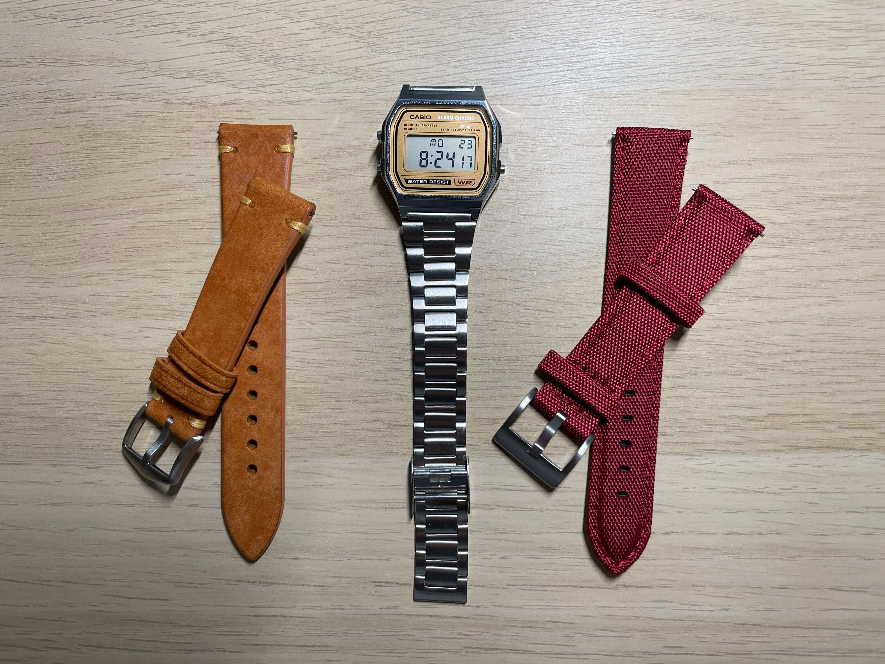

+++
date = "2025-06-22"
title = "2025-W25"
slug = "2025-W25"
categories = ["personal", "weeknotes"]
week = "2025-W25 - 16 June to 22 June"
summary = "Everybody's trying to figure me out"
+++

After four days with my new Casio A158WEA-9JH, I finally found the right fit. There’s a sweet spot where the strap sits perfectly without those sharp metal edges digging into my wrist. I’m starting to think the A158’s strap is better than the A168’s. That's [surprising](https://krabf.com/weeknotes/2025-w24/). The A168 has this annoying habit of snagging hair but the A158 doesn’t do that at all. It’s smoother and feels a bit lighter too.

I originally planned to swap out the strap on the A158, but I’m putting that on hold because I’ve actually been enjoying the stock one more than expected. Still weighing my options.  I've scrolled through hundreds of Pinterest inspo shots, and somehow I'm still undecided.

---

# The Week in Links

✺ [A redditor is trying to come up with a new shape](https://www.reddit.com/r/theories/comments/1l5e9k9/trying_to_come_up_with_a_new_shape_and_i_cant_i/)

✺ The internet is noisy. [1Feed](https://1feed.app/) isn't.

✺ [powRSS](https://powrss.com/index.html) is a public RSS feed aggregator focused on supporting the independent web by curatin
g and sharing updates from personal blogs and small websites.

✺ [Yawns](https://kottke.org/25/06/yawns) — *via* [kottke.org](https://kottke.org/?ref=krabf.com)

✺ [My perfect music app doesn't exits](https://hicks.design/journal/my-perfect-music-app-doesnt-exist) — *by* [Jon Hicks](https://hicks.design/)
 
I really enjoyed this one. You could actually feel that Jon Hicks genuinely cares about music and has actually lived with these apps, not just tried them out for a quick review. The comparisons are practical and the wish for one perfect app is something a lot of us can relate to.

---

   
<figcaption>HAIM's new album is out!</figcaption>
</figure>

