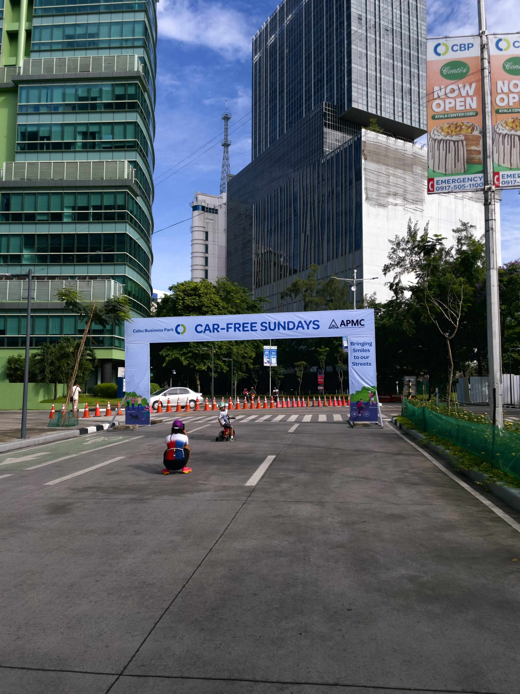

+++
date = 2025-06-29
title = "2025-W26"
slug = "2025-W26"
categories = ["personal", "weeknotes"]
week = "2025-W26 - 23 June to 29 June"
summary = "There's peace in the madness over our heads"
+++

June's wrapping up and I'm happy to say I've been walking a lot more this month. Walking has become my favorite form of physical activity this past year and I think because I get to think (A LOT) and enjoy my music without the pressure of a gym routine. I'm lucky to live in an area that's actually pedestrian-friendly, with decent sidewalks and a nearby park. Every Sunday we head to Car Free Sunday in our neighborhood, where you'll see titas and titos doing their Zumba routines. There's even a new pickleball group that's started up recently.  Now I'm hoping we can get safer, more walkable streets year-round in the city. Especially bike lanes that cars can't just park in whenever they feel like it.

  

    <figure class="sbs">

<figcaption>Pickleball Group</figcaption>
</figure>
  <figure class="sbs">

<figcaption></figcaption>

 

Another thing I *tackled* this week was the Downloads folder on my personal laptop — all 12GB of random files I don't actually use but somehow need to keep around. Plus another 100GB of project backups from work. That's a ridiculous amount of storage, but here's the thing: even though we only deliver 1080p videos at my day job, I'm the person who upscales everything to 4K because I do my motion designs in 4K. What can I say? It's not coming out of my Google Drive storage, so why not go overboard with the quality?

---

# The Week in Links

✺ [AI-made videos are quietly taking over YouTube](https://sherwood.news/tech/ai-created-videos-are-quietly-taking-over-youtube/). It's honestly pretty disturbing how AI-generated content is taking over everywhere — YouTube, Twitter, Facebook, you name it. What really gets to me is seeing these obviously fake AI videos of [Shrimp Jesus](https://www.404media.co/facebooks-algorithm-is-boosting-ai-spam-that-links-to-ai-generated-ad-laden-click-farms/?ref=krabf.com) or crying hungry children flooding my feed, and watching older people, especially boomers, COMPLETELY fall for them. They're sharing and commenting on these things like they're real, not realizing the whole thing was cooked up by some algorithm in five minutes which would be almost funny if it wasn't so depressing. Makes you wonder what happens when this stuff gets even more convincing, especially since image generation keeps getting better by the day. We're already at the point where I have to do a double-take on some of these AI images, and that's just the stuff we're seeing now. Give it another year or two and we'll probably need to squint at every photo to figure out if it's real or not. Kind of scary to think about, honestly.

✺ [PH economy after 3 years of Marcos Jr](https://www.ibon.org/ph-after-3yrs-of-pbbm/) ¯\_(ツ)_/¯

✺ Lately, I’ve been fascinated by the interfaces in sci-fi films—the control rooms, the on-screen graphics, and all the imagined tech that sets the tone for the story. And from my exploration, the timing of the Universe, I stumbled upon [Sci-Fi Interfaces](https://scifiinterfaces.com/?ref=krabf.com) that’s just otherworldly.

✺ Man, I really don’t get why some people feel the need to call out others for using em dashes in their writing. It’s such a strange thing to nitpick — people have been using them for ages, and for good reason. Sure I get that AI tools use them a lot, but there are plenty of other parts of writing where you can tell if something was generated by AI. You’ll know. That said, [here's whole site dedicated to the glory of the em dash](https://the-em-dash.com/?ref=krabf.com). — *via* [The Jolly Teapot](https://thejollyteapot.com/?ref=krabf.com)

✺ [APOSSIBLE](https://apossible.com/?ref=krabf.com) is a research and design initiative combining the work of creatives, technologists, and psychologists to create technology that supports human flourishing. They fund and provide frameworks for projects exploring how technology can be more fulfilling. Great website but sometimes clunky. Still filed under [Weird Wonderful Web](https://www.cosmos.so/krabf/weird-wonderful-web).

<video controls width="600" poster="APOSSIBLE.jpg">
  <source src="APOSSIBLE.mp4" type="video/mp4">
  APOSSIBLE's website"
</video>
<figcaption>APOSSIBLE's website</figcaption>
</figure>

---

   
<figcaption>Virgin by Lorde is so authentic and sonic.</figcaption>
</figure>

