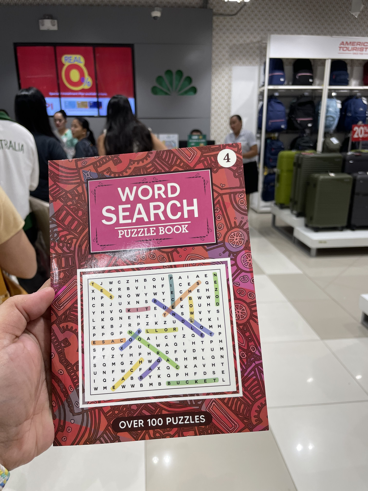
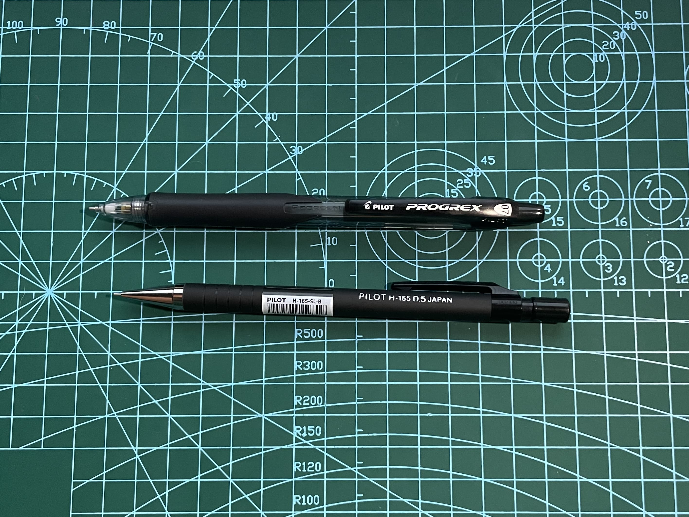

+++
date = "2025-07-06"
title = "2025-W27"
slug = "2025-W27"
categories = ["personal", "weeknotes"]
week = "2025-W27 - 30 June to 6 July"
summary = "Word Search"
+++

I've been looking for ways to stay busy that don't involve being online or glued to screens. I'm not really a phone person, I live on my laptop but I still catch myself doom scrolling, even when I'm outside trying to enjoy some sunshine.

Last week my partner and I were stuck in one of those endless mall checkout lines. Looking around for something to entertain ourselves, we spotted this puzzle book by the register and started flipping through it. The first page had this word search asking you to find "The Best Movie Director of all Time." It practically screamed "buy me" the moment I saw David Lynch's name in there. Had to have it.

We've solved around 20 puzzles in this thing already. I bring it everywhere. It might be becoming my new personality.

Of course, I had to find the perfect mechanical pencil for it. I spent 30 minutes at the store testing different ones, feeling how they write and trace lines. My partner just laughed at me, not annoyed but genuinely amazed at how particular I get about stationery.

Right now I'm using the Pilot H-165 0.5 and the Pilot Progrex 0.7 — basically all they had in stock. I really wanted to try an Ohto multi-function pen with three different tip sizes, which would be perfect for puzzles. My *dream* pen is the CW&T Pen Type-A since it has a ruler, but ₱11,300 for a pen is absolutely insane. So being the cheap person I am, I'm now shopping for tiny rulers I can actually justify carrying around everywhere.

If anyone knows of a mechanical pencil with a built-in ruler, or a ruler with a pen insert that won't cost me a fortune, let me know.

---

# The Week in Links

✺ Even though AI is sold as fully automated, it actually depends on a vast network of people who handle tasks like labeling data, moderating content, and filtering out harmful material. These [low-paid workers around the world](https://restofworld.org/2025/the-ai-con-book-invisible-labor/) do everything from drawing boxes around images to checking for hate speech and making sure AI systems don’t generate inappropriate responses. Many companies that call their work “ethical AI” actually subcontract these jobs to workers in poorer countries, where conditions are often unstable and protections are lacking. Without more transparency and better labor standards, this kind of data work remains exploitative, even though it has the potential to be a decent and sustainable job.

✺ [Hued](https://playhued.com/) is a daily game that you have to mathc color have three guesses to match a target color.

✺ [Mike Brock points out](https://www.techdirt.com/2025/07/01/the-moral-imperative-of-clear-language/?ref=krabf.com) that euphemisms and vague language make it easier for authoritarianism to thrive and for people to avoid moral responsibility.

✺ [Astronomers may have found a third interstellar object](https://arstechnica.com/space/2025/07/astronomers-may-have-found-a-third-interstellar-object/)

 ✺ Content creators are finding it harder to earn value from their work as AI tools become more common. The traditional model of trading content for web traffic is no longer working due to AI-driven answers reducing site visits. [Cloudflare is changing its default to block AI crawlers unless they compensate content creators.](https://blog.cloudflare.com/content-independence-day-no-ai-crawl-without-compensation/)

✺ [“Take Two: Roundup”](https://www.nicksimson.com//posts/2025-take-two-roundup.html) by Nick Simson recaps the [June 2025](https://www.nicksimson.com/posts/2025-indieweb-carnival-take-two.html)[IndieWeb Carnival](https://indieweb.org/IndieWeb_Carnival), where bloggers shared honest takes on do-overs, regrets, and what it means to get a second chance. Gosh I love these.

---

   
<figcaption>I think about this song a lot. Like a lot a lot.</figcaption>
</figure>

