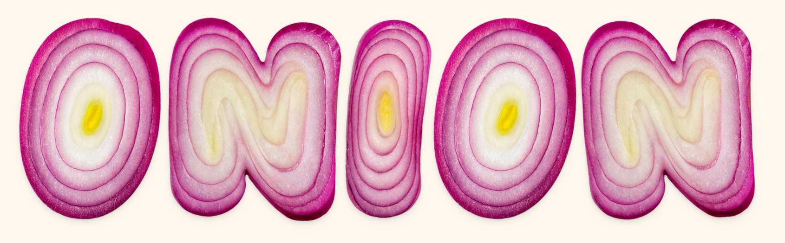

+++
date = "2025-09-07"
title = "2025-W36"
slug = "2025-W36"
categories = ["personal", "weeknotes"]
week = "2025-W36 - 31 August to 6 September"
summary = " Creative break... sort of."
+++

I didn't write anything for August at all. I figured I'd take the month off since it was my birthday month and I wanted to "treat myself" by not overthinking my blog — how it looks, what to add, fonts, accessibility, all that stuff.

The creative break was brutally suffocating to be honest. I was already on a streak of writing regularly and had my links saved for The Week in Links section, plus music and videos I wanted to share. But because I forced myself to pause for a month, I was itching to write something the entire time! The only productive thing I did for my personal projects wasn't even for my blog, it was an Obsidian revamp. My vault felt cramped and bloated with plugins and CSS I never used. So I created a fresh vault, copied over my files, switched to IBM Plex (kind of like my favorite), and now I have a fast, functioning PKM system.

Turns out taking a creative break isn't always refreshing. Sometimes it just reminds you why you started creating in the first place. September feels like a good month to get back to it.

---

# The Week in Links

✺ [Hidden Inside Our Electronics, Tiny Doodles From Another Era](https://www.nytimes.com/2025/08/12/technology/silicon-chips-doodles.html?unlocked_article_code=1.d08.JfYR.q1EiVLAjNep0)

✺ Finally, a way to cry over onions and math at the same time. The Pudding [breaks down](https://pudding.cool/2025/08/onions/) how math can help you get more even onion pieces, but also reminds readers not to stress over perfection in the kitchen.

✺ [How to Leave Substack.](https://leavesubstack.com/)

✺ [Did Shakespeare Write Hamlet While He Was Stoned?](https://lithub.com/did-shakespeare-write-hamlet-while-he-was-stoned/)

✺ Sam Kelly’s [“Did Shakespeare Write Hamlet While He Was Stoned?”](https://lithub.com/did-shakespeare-write-hamlet-while-he-was-stoned/) looks at the intriguing possibility that cannabis may have influenced Shakespeare’s creativity, blending historical evidence with literary analysis.

✺ [The Battle to Save the Soul of City Pop From AI](https://pitchfork.com/thepitch/the-battle-to-save-the-soul-of-city-pop-from-ai/)

---

<lite-youtube videoid="P_WGkWc7k-8" style="background-image: url(&quot;https://i.ytimg.com/vi/P_WGkWc7k-8/hqdefault.jpg&quot;);" class="lyt-activated"><button type="button" class="lty-playbtn">Play</button><iframe width="560" height="315" title="Play" allow="accelerometer; autoplay; encrypted-media; gyroscope; picture-in-picture" allowfullscreen="" src="https://www.youtube-nocookie.com/embed/P_WGkWc7k-8?autoplay"></iframe></lite-youtube>

Best episode on Track Star so far. IMO