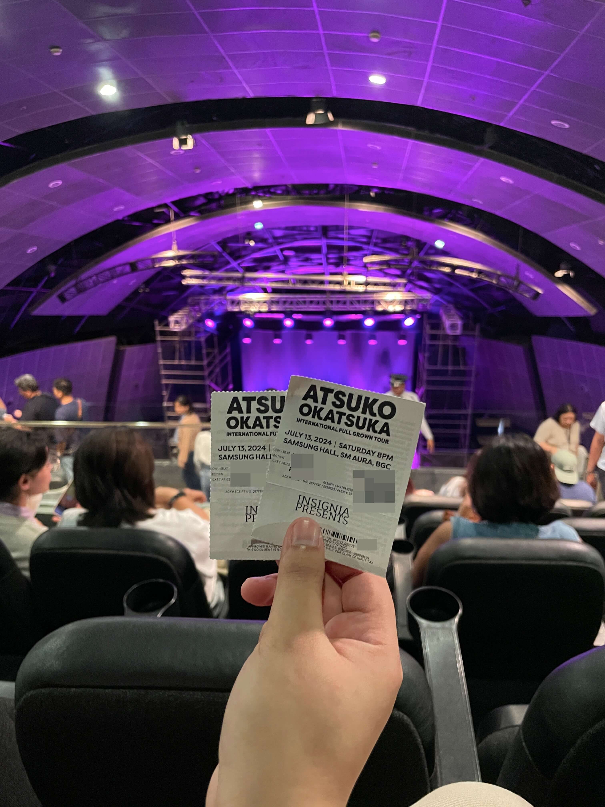

+++
date = 2024-07-14
title = "WEEKNOTES 28"
slug = "weeknotes28"
categories = ["personal", "weeknotes"]
week = "2024-W28 - 8 to 14 July"
summary = "Everything Japanese"
+++

Last Saturday, I had the awesome experience of seeing Atsuko Okatsuka perform live. I've been following her since the pandemic started, and her videos have been a constant source of joy and laughter in my life.

 

  

    <figure class="sbs">

<figcaption>Obligatory ticket photo 
</figcaption>
</figure>
  <figure class="sbs">

<figcaption>Balcony views for the cheaps but the vibe was still superb! 
</figcaption>

We went on a bit of a ramen binge this weekend.
 

  

    <figure class="sbs">

<figcaption>Amiyaki Wasshoi 
</figcaption>
</figure>
  <figure class="sbs">

<figcaption>Mendokoro Ramenba at Mitsukoshi BGC 
</figcaption>

The highlight of my week though was finally reuniting with my best friend after five long years apart. We missed each other last year when she was in town due to scheduling conflicts, but this time we made sure to carve out time to meet up. It was like no time had passed at all!

---

# The Week in Links

✈️ I have been using [Flightly](https://apps.apple.com/us/app/flighty-live-flight-tracker/id1358823008) for all my travel since last 2022, and honestly, it's been a game-changer — even the free version is spot-on for what I need. As someone who gets pretty wound up about flying (yes I am THAT person constantly digging through emails, PDFs, and texts from my partner just to double-check flight details). The only thing I'm really wishing for is if it could automatically show my seat number after I input my booking reference.

 [One week](https://krabf.com/weeknotes/weeknotes27/#:~:text=%20Phil%20Schiller%2C%20the%20head%20of%20Apple’s%20App%20Store%20and%20its%20former%20marketing%20chief%2C%20joins%20OpenAI%20boardas%20“observer”.) after Apple's Phil Schiller was assigned to sit on the board of OpenAl, [Microsoft exists Open Al's board](https://www.patentlyapple.com/2024/07/one-week-after-apples-phil-schiller-was-assigned-to-sit-on-the-board-of-openai-microsoft-exists-open-ais-board.html/?ref=krabf.com)

🍱 [Pestle](https://pestlechef.app/?ref=krabf.com) recipe app just added a cool [new feature](https://pestlechef.app/blog/save-recipes-from-instagram/?ref=krabf.com) wherein you can import recipes straight from Instagram. But that $20/year price to sync across devices? Pass. *via [The Installer No. 45](https://www.theverge.com/24197282/cmf-phone-1-diggnation-galaxy-ring-installer-newsletter?ref=krabf.com)*

💼 [How to Stop Taking Work So Personally](https://hbr.org/2023/10/how-to-stop-taking-work-so-personally?ref=krabf.com)

🐉 [If dragons were real, how might fire-breathing work?](https://theconversation.com/house-of-the-dragon-if-dragons-were-real-how-might-fire-breathing-work-232777)

🤖 TUAW, a former Apple-centric tech blog, [is publishing AI-generated articles using the names of its old human staff.](https://www.404media.co/a-beloved-tech-blog-tuaw-is-now-publishing-ai-articles-under-the-names-of-its-old-human-staff?ref=krabf.com) [Christina Warren's](https://mastodon.social/@film_girl/112758216249922551) identity was stolen for AI posts.

🖼️ [Artvee](https://artvee.com/?ref=krabf.com) is a great resource for exploring and downloading high-resolution, public domain art. It's an excellent platform for art lovers and researchers alike.

---

<lite-youtube videoid="mSlZKdApob0" style="background-image: url(&quot;https://i.ytimg.com/vi/mSlZKdApob0/hqdefault.jpg&quot;);" class="lyt-activated"><button type="button" class="lty-playbtn">Play</button><iframe width="560" height="315" title="Play" allow="accelerometer; autoplay; encrypted-media; gyroscope; picture-in-picture" allowfullscreen="" src="https://www.youtube-nocookie.com/embed/mSlZKdApob0?autoplay"></iframe></lite-youtube>

YESSSSS!!!!