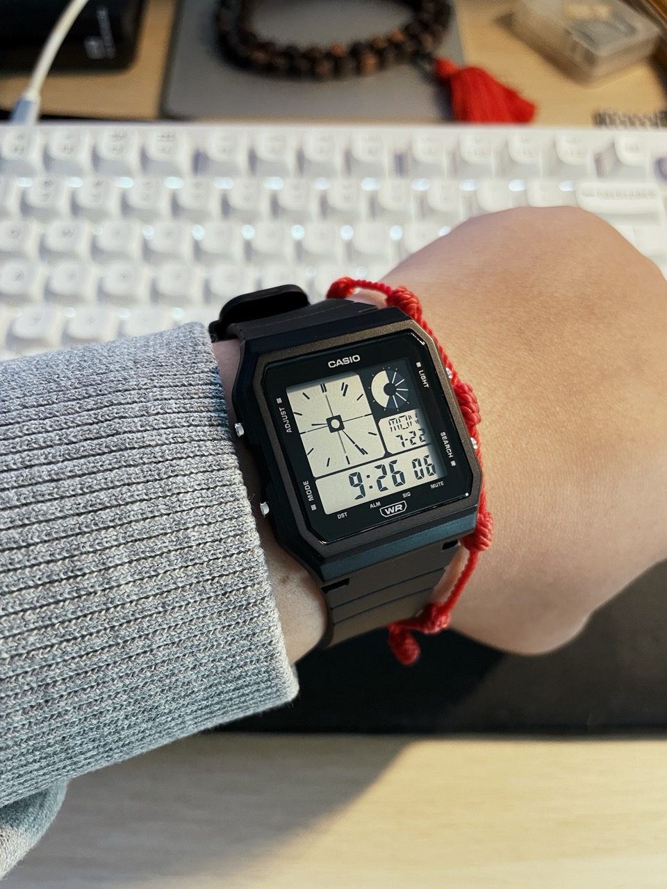
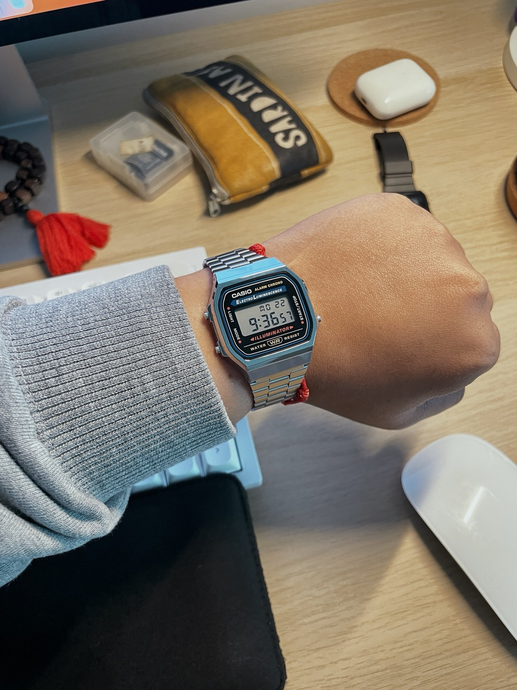

+++
date = 2024-07-21
title = "WEEKNOTES 29"
slug = "weeknotes29"
categories = ["personal", "weeknotes"]
week = "2024-W29 - 15 to 21 July"
summary = "Wrist check!"
+++

I went a bit wild this weekend and did a thing... or two. I picked up the Casio A168 and the LF-20. At a 20% discount! I've been itching to get one ever since I stumbled across a post from r/Watches. I guess you could call it an upgrade... or maybe a downgrade? I prefer an upgrade from my Apple Watch Series 6's battery life. Either way, I was genuinely surprised to see these classic timepieces were still going strong. I was tempted by the A158, but after doing some research, I found out its backlight was pretty terrible.

The shop I went to didn't have the A1200 in stainless steel, which was a bit of a bummer. I'm still keeping that one on my radar though, especially after seeing some of the cool mods from the community. I'm excited but also kind of worried about this thing I've gotten into.

 

  

    <figure class="sbs">

<figcaption>Casio LF-20W 
</figcaption>
</figure>
  <figure class="sbs">

<figcaption>Casio A168 
</figcaption>

---

# The Week in Links

📻 [Overcast celebrates its 10th anniversary with redesigned interface](https://www.macstories.net/reviews/overcast-celebrates-its-tenth-anniversary-with-a-redesigned-interface/)

💄 [In an attention economy, aesthetics play an integral role in projecting success and your standing in society.](https://www.dazeddigital.com/beauty/article/62929/1/the-rise-of-people-choosing-friends-for-their-feeds)

👁️‍🗨️ [Understanding the Eye-Mind Connection](https://www.chrbutler.com/understanding-the-eye-mind-connection)

⌚ Everything you need. In the palm of your hand. [tinyPod](https://thetinypod.com/)

❤️‍🔥 [Mary Oliver on What Attention Really Means and Her Moving Elegy for Her Soul Mate](https://www.themarginalian.org/2015/01/20/mary-oliver-molly-malone-cook-our-world/)

🖼️ [2Craigs](https://www.2craigs.com/) *via* [Chris Glass](https://chrisglass.com/)

⚠️ [Major Windows BSOD issue hits banks, airlines, and TV broadcasters](https://www.theverge.com/2024/7/19/24201717/windows-bsod-crowdstrike-outage-issue)

🤖 Proof News created a [tool](https://www.proofnews.org/youtube-ai-search/) to search for creators in the YouTube AI training dataset. I see old materials from my current company being used.

📃 [Smol Pub](https://smol.pub/), a tiny blogging hosting service

---

<lite-youtube videoid="Bnzs3YPqFJM" style="background-image: url(&quot;https://i.ytimg.com/vi/Bnzs3YPqFJM/hqdefault.jpg&quot;);" class="lyt-activated"><button type="button" class="lty-playbtn">Play</button><iframe width="560" height="315" title="Play" allow="accelerometer; autoplay; encrypted-media; gyroscope; picture-in-picture" allowfullscreen="" src="https://www.youtube-nocookie.com/embed/Bnzs3YPqFJM?autoplay"></iframe></lite-youtube>

I have to admit, I have a big crush on Ellis!